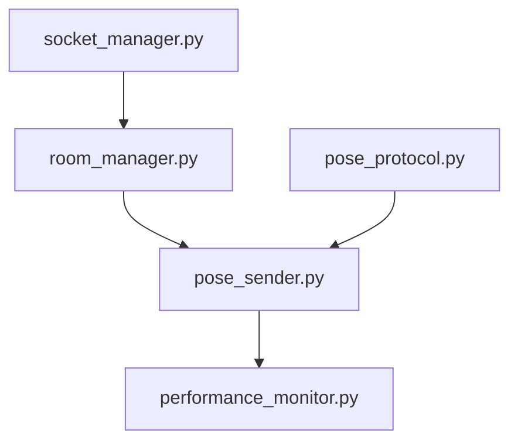

# Socket传输模块设计

## 1. socket_manager.py - 基础连接管理

### 职责
- 管理WebSocket连接生命周期
- 处理连接状态和重连
- 基础事件收发
- 错误处理和日志

### 接口定义
```python
@dataclass
class ConnectionConfig:
    url: str = 'http://localhost:5000'
    reconnect_attempts: int = 5
    reconnect_delay: int = 1000
    heartbeat_interval: int = 25000

@dataclass
class ConnectionStatus:
    connected: bool
    last_heartbeat: float
    reconnect_count: int
    error_count: int

class SocketManager:
    def __init__(self, config: ConnectionConfig = None):
        """初始化连接管理器"""
    
    def connect(self) -> bool:
        """建立连接"""
    
    def disconnect(self):
        """断开连接"""
    
    def emit(self, event: str, data: Dict[str, Any], room: str = None) -> bool:
        """发送数据到指定房间"""
    
    def on(self, event: str, handler: Callable):
        """注册事件处理器"""
    
    def register_error_handler(self, handler: Callable[[str, Exception], None]):
        """注册错误处理器"""
    
    def get_status(self) -> ConnectionStatus:
        """获取连接状态"""
    
    @property
    def connected(self) -> bool:
        """连接状态"""
    
    def set_reconnect_strategy(self, strategy: ReconnectStrategy):
        """设置重连策略"""
    
    def set_heartbeat_handler(self, handler: Callable[[], bool]):
        """设置心跳处理器"""
    
    def get_connection_stats(self) -> Dict[str, float]:
        """获取连接统计信息"""
```

### 技术要求
- 连接成功率 > 99%
- 重连延迟 < 2秒
- 心跳正常
- 资源释放完整

### 监控指标
1. 连接指标
   - 连接状态
   - 最后心跳时间
   - 重连次数
   - 错误次数

2. 性能指标
   - 事件处理延迟
   - 消息队列长度
   - 发送成功率

3. 资源指标
   - 连接数量
   - 内存使用
   - CPU使用率

## 2. room_manager.py - 房间管理

### 职责
- 管理房间的加入和离开
- 维护房间状态
- 处理房间级别事件
- 房间成员管理

### 接口定义
```python
@dataclass
class RoomConfig:
    max_clients: int = 10
    timeout: int = 30
    auto_cleanup: bool = True

@dataclass
class RoomStatus:
    room_id: str
    member_count: int
    created_time: float
    last_active: float
    is_locked: bool

@dataclass
class RoomMember:
    id: str
    join_time: float
    last_active: float
    role: str = 'member'  # 'host' or 'member'

class RoomManager:
    def __init__(self, socket: SocketManager, config: RoomConfig = None):
        """初始化房间管理器"""
    
    def create_room(self, room_id: str) -> bool:
        """创建房间"""
    
    def join_room(self, room_id: str) -> bool:
        """加入房间"""
    
    def leave_room(self, room_id: str):
        """离开房间"""
    
    def broadcast(self, event: str, data: Dict[str, Any], room_id: str) -> bool:
        """广播到房间"""
    
    def get_room_info(self, room_id: str) -> RoomStatus:
        """获取房间信息"""
    
    def list_rooms(self) -> List[RoomStatus]:
        """获取所有房间列表"""
    
    def clean_inactive_rooms(self):
        """清理不活跃房间"""
    
    @property
    def current_room(self) -> Optional[str]:
        """当前房间ID"""
    
    def get_members(self, room_id: str) -> List[RoomMember]:
        """获取房间成员列表"""
    
    def update_member_status(self, room_id: str, member_id: str):
        """更新成员状态"""
    
    def set_member_role(self, room_id: str, member_id: str, role: str):
        """设置成员角色"""
    
    def kick_member(self, room_id: str, member_id: str):
        """踢出成员"""
```

### 技术要求
- 房间操作延迟 < 50ms
- 成员同步延迟 < 100ms
- 房间状态一致性 100%
- 自动清理无效房间

### 监控指标
1. 房间指标
   - 活跃房间数
   - 每房间成员数
   - 房间存活时间
   - 清理频率

2. 性能指标
   - 房间操作延迟
   - 广播延迟
   - 状态同步延迟

3. 资源指标
   - 总房间数量
   - 总成员数量
   - 内存占用

## 3. pose_sender.py - 传输控制

### 职责
- 管理姿态数据发送
- 控制传输频率
- 处理数据缓冲
- 监控传输性能

### 接口定义
```python
class PoseSender:
    def __init__(self, room_manager: RoomManager, protocol: PoseProtocol):
        """初始化发送器"""
    
    def send_frame(self, 
                  room_id: str,
                  pose_results,
                  face_results=None, 
                  hands_results=None) -> bool:
        """发送单帧数据"""
    
    def get_stats(self) -> Dict[str, float]:
        """获取性能统计
        Returns:
            {
                'fps': float,          # 当前帧率
                'latency': float,      # 平均延迟(ms)
                'success_rate': float, # 发送成功率
                'cpu_usage': float,    # CPU使用率
                'memory_usage': float  # 内存使用(MB)
            }
        """
    
    @property
    def fps(self) -> float:
        """获取当前帧率"""
        
    def start_monitoring(self):
        """开始性能监控"""
        
    def stop_monitoring(self):
        """停止性能监控"""
    
    def set_send_config(self, config: SendConfig):
        """设置发送配置"""
    
    def get_queue_status(self) -> Dict[str, int]:
        """获取队列状态"""
    
    def clear_queue(self):
        """清空发送队列"""
    
    def pause_sending(self):
        """暂停发送"""
    
    def resume_sending(self):
        """恢复发送"""
```

### 技术要求
- 实时传输延迟 < 50ms
- 稳定帧率 >= 25fps
- CPU占用 < 30%
- 发送成功率 > 99%
- 平滑的帧率控制
- 完整的性能监控

### 性能监控指标
1. 实时指标
   - 当前帧率
   - 传输延迟
   - CPU使用率
   - 内存使用
   - 发送队列长度

2. 统计指标
   - 平均帧率
   - 最大/最小延迟
   - 丢帧率
   - 发送成功率
   - 带宽使用

3. 告警指标
   - 帧率过低 (< 20fps)
   - 延迟过高 (> 100ms)
   - CPU过载 (> 50%)
   - 内存泄漏
   - 连续发送失败

### 监控日志
```python
@dataclass
class PerformanceLog:
    timestamp: float
    fps: float
    latency: float
    cpu_usage: float
    memory_usage: float
    queue_size: int
    success_rate: float
    
class PerformanceMonitor:
    def log_performance(self) -> PerformanceLog:
        """记录性能日志"""
    
    def get_statistics(self) -> Dict[str, float]:
        """获取统计信息"""
    
    def check_alerts(self) -> List[str]:
        """检查告警"""
```

## 依赖关系


## 错误处理
1. 连接错误
   - 自动重连
   - 状态恢复
   - 错误通知

2. 房间错误
   - 重新加入
   - 状态同步
   - 成员清理

3. 数据错误
   - 数据验证
   - 错误跳过
   - 日志记录

4. 性能错误
   - 自动降级
   - 资源释放
   - 告警通知

## 测试覆盖
1. 单元测试
   - 连接生命周期
   - 房间操作
   - 数据处理
   - 性能监控

2. 集成测试
   - 端到端传输
   - 多房间场景
   - 异常恢复
   - 性能退化

3. 性能测试
   - 高并发连接
   - 大量数据传输
   - 资源使用监控
   - 长期稳定性