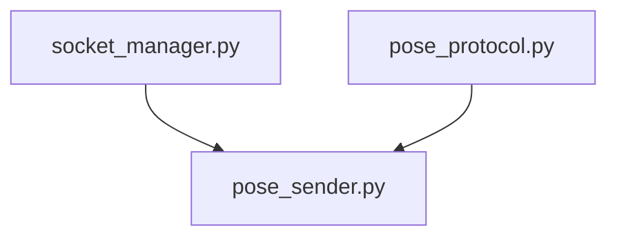

# Socket传输模块设计

## 1. socket_manager.py - 基础连接管理

### 职责
- 管理WebSocket连接的生命周期
- 处理连接状态和重连
- 提供基础的事件收发机制
- 错误处理和日志记录

### 接口定义
```python
@dataclass
class ConnectionConfig:
    url: str
    reconnect_attempts: int
    reconnect_delay: int
    heartbeat_interval: int

class SocketManager:
    def __init__(self, config: ConnectionConfig = None):
        """初始化连接管理器"""
    
    def connect(self) -> bool:
        """建立连接"""
    
    def disconnect(self):
        """断开连接"""
    
    def is_connected(self) -> bool:
        """获取连接状态"""
    
    def emit(self, event: str, data: Any) -> bool:
        """发送事件数据"""
    
    def on(self, event: str, handler: Callable):
        """注册事件处理器"""
```

### 技术要求
- 连接成功率 > 99%
- 自动重连延迟 < 2秒
- 心跳保持正常
- 资源正确释放
- 完整的错误处理
- 详细的日志记录

## 2. pose_protocol.py - 数据协议

### 职责
- 定义姿态数据结构
- 实现数据编解码
- 处理数据压缩
- 数据验证和错误检测

### 接口定义
```python
@dataclass
class PoseData:
    pose_landmarks: List[Dict[str, float]]
    face_landmarks: Optional[List[Dict[str, float]]]
    hand_landmarks: Optional[List[Dict[str, float]]]
    timestamp: float
    frame_id: int

class PoseProtocol:
    def __init__(self, compression_level: int = 6):
        """初始化协议处理器"""
    
    def encode(self, pose_data: PoseData) -> bytes:
        """编码并压缩数据"""
    
    def decode(self, data: bytes) -> PoseData:
        """解压缩并解码数据"""
    
    def validate(self, pose_data: PoseData) -> bool:
        """验证数据有效性"""
```

### 技术要求
- 数据完整性 100%
- 压缩率 > 50%
- 编解码延迟 < 5ms
- 内存使用稳定
- 错误检测完整
- 类型安全

## 3. pose_sender.py - 传输控制

### 职责
- 管理姿态数据发送
- 控制传输频率
- 处理数据缓冲
- 监控传输性能

### 接口定义
```python
class PoseSender:
    def __init__(self, socket: SocketManager, protocol: PoseProtocol):
        """初始化发送器"""
    
    def send_frame(self, 
                  pose_results,
                  face_results=None, 
                  hands_results=None) -> bool:
        """发送单帧数据"""
    
    def get_stats(self) -> Dict[str, float]:
        """获取性能统计"""
    
    @property
    def fps(self) -> float:
        """获取当前帧率"""
```

### 技术要求
- 实时传输延迟 < 50ms
- 稳定帧率 >= 25fps
- CPU占用 < 30%
- 发送成功率 > 99%
- 平滑的帧率控制
- 完整的性能监控

## 依赖关系


## 错误处理
1. 所有公开方法必须处理异常
2. 错误必须记录到日志
3. 关键错误必须通知调用者
4. 非关键错误应自动恢复

## 性能监控
1. 记录关键指标:
   - 连接状态
   - 传输延迟
   - 帧率
   - 内存使用
   - CPU使用率
   
2. 性能日志:
   - 定期记录统计信息
   - 异常情况详细记录
   - 性能瓶颈分析

## 测试覆盖
1. 单元测试 > 90%
2. 集成测试覆盖所有关键路径
3. 性能测试验证所有指标
4. 压力测试确保稳定性