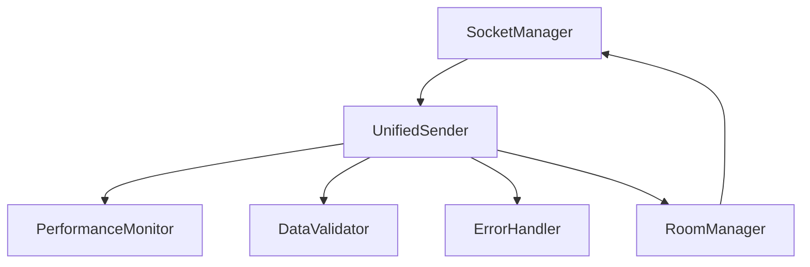

# Connect 模块设计文档

## 1. 核心功能
- 实时姿态数据传输
- 音频数据传输
- 房间管理
- 性能监控

## 2. 系统架构


## 3. 关键问题和解决方案

### 3.1 实时性问题
**问题:**
- 网络延迟导致动作不同步
- 数据堆积造成内存增长
- 带宽限制影响传输质量

**解决方案:**
```python
class UnifiedSender:
    async def send(self, data_type: str, data: Dict, priority: int = 0):
        # 1. 优先级队列处理
        if self.queue.full():
            self._drop_low_priority_data()
            
        # 2. 数据压缩
        if len(data) > self.compression_threshold:
            data = self._compress(data)
            
        # 3. 带宽控制
        await self._rate_limit()
```

### 3.2 可靠性问题
**问题:**
- 网络断开需要重连
- 数据可能丢失
- 房间状态不同步

**解决方案:**
```python
class SocketManager:
    async def ensure_connection(self):
        if not self.connected:
            await self._reconnect()
            await self._sync_state()
            
class RoomManager:
    async def sync_room_state(self, room_id: str):
        state = await self._fetch_room_state(room_id)
        await self._broadcast_state_update(room_id, state)
```

### 3.3 性能问题
**问题:**
- CPU使用率过高
- 内存泄漏
- 帧率不稳定

**解决方案:**
```python
class PerformanceMonitor:
    def __init__(self):
        self.metrics = {
            'cpu_usage': deque(maxlen=100),
            'memory_usage': deque(maxlen=100),
            'fps': deque(maxlen=100)
        }
        self.alerts = AlertManager()
```

## 4. 实现优先级

### 4.1 第一阶段 - 基础功能
1. 简化SocketManager
2. 实现UnifiedSender
3. 基础房间管理

### 4.2 第二阶段 - 性能优化
1. 实现性能监控
2. 添加带宽控制
3. 优化数据压缩

### 4.3 第三阶段 - 可靠性提升
1. 完善错误处理
2. 添加状态同步
3. 实现数据验证

## 5. 关键接口

### 5.1 数据发送
```python
async def send_pose_data(
    pose_data: Dict[str, Any],
    room_id: str,
    priority: int = 5
) -> bool
```

### 5.2 房间管理
```python
async def join_room(
    room_id: str,
    user_id: str,
    role: str = 'member'
) -> bool
```

### 5.3 性能监控
```python
def get_performance_metrics() -> Dict[str, float]:
    """返回关键性能指标"""
    pass
```

## 6. 测试重点
- 网络断开重连
- 高并发数据发送
- 内存泄漏检测
- 性能压力测试

## 7. 注意事项
- 避免阻塞操作
- 及时清理资源
- 做好日志记录
- 优先保证实时性

# Connect 模块测试规范

## 1. 测试文件结构
```
tests/connect/
├── __init__.py
├── test_unified_sender.py     # 统一的发送器测试
├── test_socket_manager.py     # Socket连接测试
├── test_room_manager.py       # 房间管理测试
├── test_performance.py        # 性能监控测试
├── test_integration.py        # 集成测试
└── test_stability.py          # 稳定性测试
```

## 2. 核心测试场景

### 2.1 实时性测试
```python
class TestRealtime:
    def test_latency(self):
        """测试端到端延迟"""
        sender = UnifiedSender(socket_manager, monitor)
        for _ in range(100):
            start = time.time()
            sender.send(data_type='pose', data=pose_data)
            latency = time.time() - start
            assert latency < 0.05  # 50ms延迟要求

    def test_bandwidth_control(self):
        """测试带宽控制"""
        sender.set_bandwidth_limit(1000000)  # 1MB/s
        # 发送大量数据验证带宽限制
```

### 2.2 可靠性测试
```python
class TestReliability:
    def test_reconnection(self):
        """测试断线重连"""
        socket_manager.disconnect()
        time.sleep(1)
        assert socket_manager.connected  # 自动重连
        assert room_manager.current_room  # 房间恢复

    def test_data_integrity(self):
        """测试数据完整性"""
        # 发送数据并验证接收
```

### 2.3 性能测试
```python
class TestPerformance:
    def test_high_load(self):
        """测试高负载"""
        monitor = PerformanceMonitor()
        for _ in range(1000):
            sender.send(data_type='pose', data=pose_data)
        stats = monitor.get_stats()
        assert stats['cpu_usage'] < 30
        assert stats['memory_growth'] < 100  # MB

    def test_concurrent_users(self):
        """测试并发用户"""
        # 模拟多用户场景
```

## 3. 测试优先级

### 3.1 P0级测试（必须通过）
- 基本连接功能
- 数据发送接收
- 房间基本操作
- 错误恢复机制

### 3.2 P1级测试（重要）
- 性能指标监控
- 并发操作处理
- 网络异常处理
- 数据完整性验证

### 3.3 P2级测试（次要）
- 边界条件测试
- 压力测试
- 长期稳定性
- 资源使用监控

## 4. 测试数据准备

### 4.1 姿态数据生成器
```python
def generate_test_pose(landmark_count: int = 33) -> Dict:
    return {
        'landmarks': [
            {
                'x': random.random(),
                'y': random.random(),
                'z': random.random(),
                'visibility': random.random()
            }
            for _ in range(landmark_count)
        ]
    }
```

### 4.2 音频数据生成器
```python
def generate_test_audio(duration: float = 1.0) -> bytes:
    sample_rate = 44100
    samples = np.random.random(int(duration * sample_rate))
    return samples.tobytes()
```

## 5. 测试环境要求

### 5.1 硬件要求
- CPU: >= 4核
- 内存: >= 8GB
- 网络: >= 100Mbps

### 5.2 软件要求
- Python 3.12
- pytest >= 7.0
- pytest-asyncio
- pytest-cov

## 6. 测试报告要求

### 6.1 性能报告
```python
def generate_performance_report():
    return {
        'latency': {
            'avg': 0.0,
            'p95': 0.0,
            'p99': 0.0
        },
        'resource_usage': {
            'cpu': 0.0,
            'memory': 0.0
        },
        'reliability': {
            'success_rate': 0.0,
            'error_rate': 0.0
        }
    }
```

### 6.2 覆盖率要求
- 单元测试覆盖率 > 90%
- 集成测试覆盖率 > 80%
- 关键路径覆盖率 = 100%
