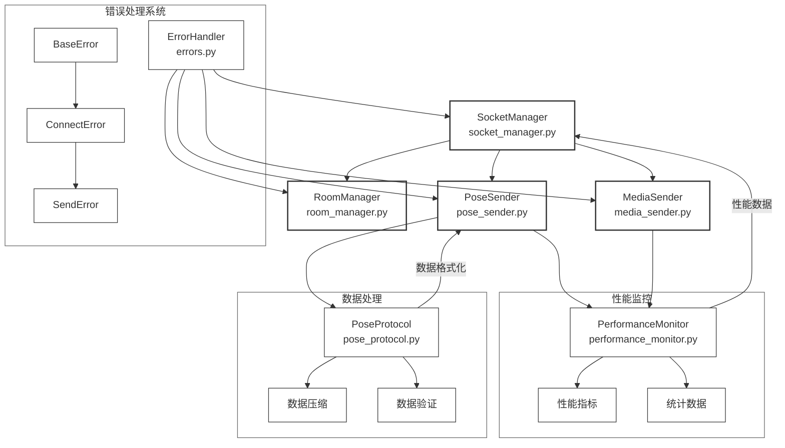
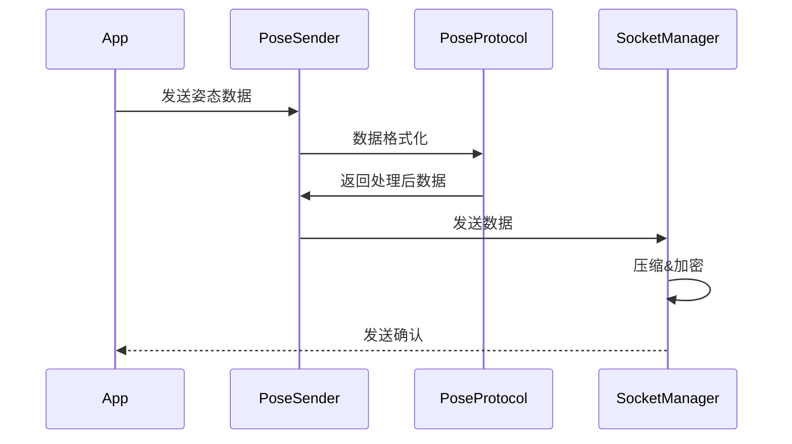
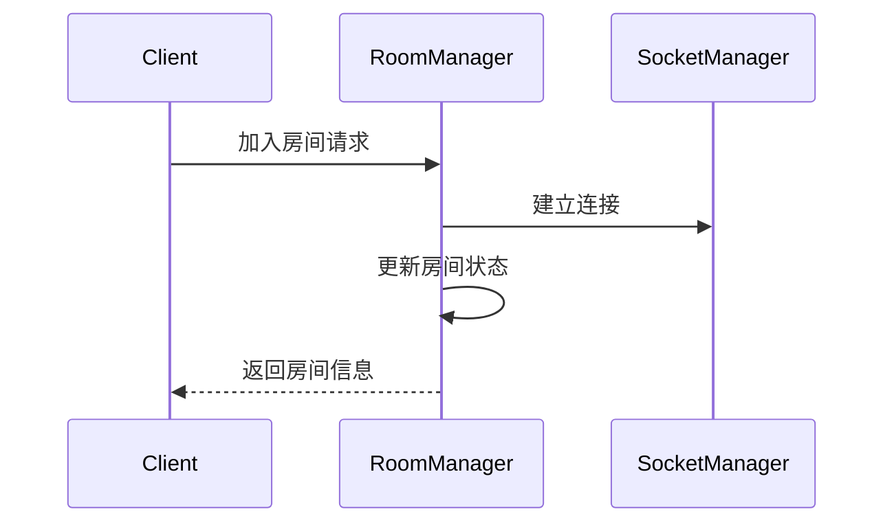

# Connect 模块设计文档

## 1. 核心功能
- 实时姿态数据传输
- 音频数据传输
- 房间管理
- 性能监控

## 2. 系统架构


## 3. 各组件功能介绍

### 3.1 核心组件功能

#### 3.1.1 SocketManager (socket_manager.py)

##### ConnectionConfig类:
定义连接配置
- url: str = 'http://localhost:5000' 默认连接地址   
- reconnect_attempts: int = 5 默认重连次数
- reconnect_delay: int = 1000  # milliseconds 默认重连延迟
- heartbeat_interval: int = 25000  # milliseconds 默认心跳间隔

##### ConnectionStatus类:
定义连接状态
- connected: bool = False 连接状态
- last_heartbeat: float = 0 最后一次心跳时间
- reconnect_count: int = 0 重连次数
- error_count: int = 0 错误次数
- connection_id: str = '' 连接ID

SecurityConfig类:
定义安全配置
- secret_key: str = "your-secret-key"  JWT密钥
- token_expiry: int = 3600  Token过期时间(秒)
- encryption_enabled: bool = True  是否启用加密
- compression_level: int = 6  压缩级别(0-9)

##### SocketManager类:
定义Socket管理器
- instances: list = [] 实例列表
- active_connections: int = 0 活跃连接数
- lock: threading.Lock = threading.Lock() 线程锁

###### _init_ 方法
```python
def __init__(self, socketio)
```

- 初始化 SocketManager 实例。
```python
self.socketio = socketio
self.logger = logging.getLogger(__name__)
```

- 初始化连接状态（_status），安全配置（security_config），认证状态（_authenticated），连接池管理器状态（_pool_manager_started），心跳状态（_heartbeat_running）。
```python
self._status = ConnectionStatus()
self.security_config = SecurityConfig()
self._authenticated = False
self._pool_manager_started = False
self._heartbeat_running = False
```

- 尝试从 config.yaml 文件中读取配置,如果读取失败，使用默认配置。
```python
try:
    with open('config/config.yaml', 'r', encoding='utf-8') as f:
        self.config = yaml.safe_load(f)['socket']
except Exception as e:
    self.logger.warning(f"无法读取配置文件，使用默认配置: {str(e)}")
    self.config = {
        'max_connections': 10,
        'ping_timeout': 60,
        'ping_interval': 25,
        'reconnect_attempts': 5,
        'reconnect_delay': 1000,
        'heartbeat_interval': 25000,
        'url': 'http://localhost:5000'
    }
``` 

- 初始化数据缓存队列（_cached_data）；初始化原始数据列表（original_data），用于测试；初始化数据恢复标志（_restore_pending）。
```python
self._cached_data = deque(maxlen=100)
self.original_data = []  # 用于测试验证
self._restore_pending = False
```

- 初始化事件时间队列（_event_times）， 初始化消息队列（_message_queue），初始化成功和总消息计数器（_success_count），（_total_count）。
```python
self._event_times = deque(maxlen=100)
self._message_queue = deque(maxlen=1000)
self._success_count = 0
self._total_count = 0
```

- 初始化事件处理器字典（_event_handlers），初始化心跳任务（_heartbeat_task），初始化心跳处理器（_heartbeat_handler）。  
```python
self._event_handlers = {}
self._heartbeat_task = None
self._heartbeat_handler = None
```

- 如果传入的 socketio 是 Mock 对象，则直接使用;否则，创建一个Socket.IO 客户端实例，配置重连参数。
```python
if isinstance(socketio, Mock):
    self.sio = socketio  # 测试时使用 mock
else:
    self.sio = socketio.Client(
        reconnection=True,
        reconnection_attempts=self.config['reconnect_attempts'],
        reconnection_delay=self.config['reconnect_delay'] / 1000
    )
```

- 设置事件处理器（_setup_event_handlers），启用数据压缩，设置压缩阈值（1KB），启动连接池管理器（_start_pool_manager）。
```python
self._setup_event_handlers()
self.enable_compression()
self.set_compression_threshold(1024)  # 1KB
self._start_pool_manager()
```


###### connect 方法
```python
def connect(self) -> bool:
```

- 使用线程锁确保线程安全，如果已经连接，则直接返回 True。
```python
  with self._lock:  # 使用线程锁
        try:
            if self.connected:
                return True
``` 

- 检查当前活动连接数是否超过最大限制，  如果超过，抛出 ConnectionError。
```python
if self.active_connections >= self.config['max_connections']:
    raise ConnectionError("连接数超过最大限制")
```

- 如果是测试模式（Mock），直接设置连接状态为成功，生成连接 ID，启动心跳机制（_start_heartbeat），将实例添加到 _instances 列表并增加活动连接数。
```python
if isinstance(self.sio, Mock):
    self._status.connected = True
    self._status.connection_id = str(uuid.uuid4())
    self._start_heartbeat()
    self.instances.append(self)
    self.active_connections += 1
    return True
```

- 使用 Socket.IO 客户端连接到指定的 URL，设置连接状态为成功，启动心跳机制，将实例添加到 _instances 列表并增加活动连接数。
```python
self.sio.connect(self.config['url'])
self._status.connected = True
self._status.connection_id = str(uuid.uuid4())
self._start_heartbeat()
self.instances.append(self)
self.active_connections += 1
return True
```

- 捕获异常并记录日志，增加错误计数。    
```python
except Exception as e:
    self.logger.error(f"连接失败: {str(e)}")
    self._status.error_count += 1
    raise ConnectionError(f"连接失败: {str(e)}")
```


###### disconnect 方法
```python
def disconnect(self) -> bool:
``` 
- 停止心跳机制（_stop_heartbeat），如果连接已建立，则断开连接，更新连接状态和活动连接数，从 _instances 列表中移除当前实例，捕获异常并记录日志。
```python
try:
        self._stop_heartbeat()
        if self.connected:
            if not isinstance(self.sio, Mock):
                self.sio.disconnect()
            self._status.connected = False
            SocketManager._active_connections = max(0, SocketManager._active_connections - 1)
        if self in SocketManager._instances:
            SocketManager._instances.remove(self)
    except Exception as e:
        self.logger.error(f"断开连接失败: {str(e)}")
        self._status.error_count += 1
```

###### authenticate 方法
```python
def authenticate(self, credentials: Dict[str, str]) -> bool:
``` 

- 检查凭证是否完整， 如果缺少用户名或密码，抛出 AuthError。
```python
try:
        if not credentials.get('username') or not credentials.get('password'):
            raise AuthError("Missing credentials")
```

- 调用 _validate_credentials 方法验证凭证，如果凭证有效，生成 JWT Token 并设置认证状态为成功，如果凭证无效，抛出 AuthError。 
```python
is_valid = self._validate_credentials(credentials)
if is_valid:
    token = self._generate_token(credentials['username'])
    self._authenticated = True
    return True
    except AuthError as e:
    self.logger.error(f"认证失败: {str(e)}")
    raise AuthError(str(e))
```

- 捕获异常并记录日志，  抛出 AuthError。
```python
except AuthError as e:
    self.logger.error(f"认证失败: {str(e)}")
    raise AuthError(str(e))
```

###### _validate_credentials 方法
```python
def _validate_credentials(self, credentials: Dict[str, str]) -> bool:
```

- 定义一个硬编码的用户凭证字典（valid_users），检查传入的用户名和密码是否匹配。
```python
 valid_users = {
        'admin': 'admin123',
        'user': 'user123'
    }
    return (credentials['username'] in valid_users and 
            credentials['password'] == valid_users[credentials['username']])
```

###### _generate_token 方法
```python
def _generate_token(self, username: str) -> str:
```

- 构造 JWT 负载（payload），包含用户名和过期时间，使用 PyJWT 生成 JWT Token。
```python
try:
            payload = {
                'username': username,
                'exp': int(time.time() + self.security_config.token_expiry)
            }
            token = PyJWT.encode(
                payload,
                self.security_config.secret_key,
                algorithm='HS256'
            )
            return token if isinstance(token, str) else token.decode('utf-8')
        except Exception as e:
            self.logger.error(f"Token生成失败: {str(e)}")
            raise
```

###### _verify_token 方法
```python
def _verify_token(self, token: str) -> bool:
```

- 使用 PyJWT 验证 JWT Token，捕获过期、无效等错误，并返回验证结果。
```python
 try:
        PyJWT.decode(
            token,
            self.security_config.secret_key,
            algorithms=['HS256']
        )
        return True
    except PyJWT.ExpiredSignatureError:
        self.logger.warning("Token已过期")
        return False
    except PyJWT.InvalidTokenError:
        self.logger.warning("无效的Token")
        return False
    except Exception as e:
        self.logger.error(f"Token验证失败: {str(e)}")
        return False
```

###### emit 方法
```python
def emit(self, event: str, data: Dict[str, Any], room: str = None) -> bool:
```

- 检查是否已认证，如果未认证，抛出 AuthError。
```python
 try:
        if not self._authenticated:
            raise AuthError("Not authenticated")
```

- 调用 _get_available_connection 获取可用连接，如果没有可用连接，抛出 ConnectionError。
```python
conn = self._get_available_connection()
if not conn:
    raise ConnectionError("No available connections")
```

- 调用 _process_data 处理数据（压缩、签名等），将数据缓存到 _cached_data。
```python
processed_data = self._process_data(data)
self._cache_data(event, data, room)
self._event_times.append(time.time())
```

- 使用 Socket.IO 客户端发送数据，如果指定了 room，则发送到指定房间。
```python
if room:
    conn.sio.emit(event, processed_data, room=room)
else:
    conn.sio.emit(event, processed_data)
```

- 增加成功和总消息计数，更新连接的最后活动时间。    
```python
self._success_count += 1
self._total_count += 1
conn.last_activity = time.time()
return True
```
- 捕获异常并记录日志，增加错误计数，抛出异常。
```python
except AuthError as e:
    self.logger.error(f"发送数据失败: {str(e)}")
    self._status.error_count += 1
    raise  # 直接抛出认证错误
except Exception as e:
    self.logger.error(f"发送数据失败: {str(e)}")
    self._status.error_count += 1
    raise ConnectionError(f"发送失败: {str(e)}")
```

###### _process_data 方法
```python
def _process_data(self, data: Dict[str, Any]) -> Dict[str, Any]:
```

- 将数据序列化为 JSON 字符串
```python
json_data = json.dumps(data)
```

- 如果启用了压缩且数据大小超过阈值，则对数据进行压缩并 Base64 编码，否则直接返回 JSON 字符串。
```python
if self.compression_enabled and len(json_data) > self.compression_threshold:
    compressed = zlib.compress(
        json_data.encode(), 
        level=self.security_config.compression_level
    )
    processed = {
        'compressed': True,
        'data': base64.b64encode(compressed).decode()
    }
else:
    processed = {
        'compressed': False,
        'data': json_data
    }
```

- 添加时间戳，调用 _sign_data 对数据进行签名，返回处理后的数据。
```python
processed['timestamp'] = time.time()
processed['signature'] = self._sign_data(processed['data'])
return processed
```

###### _sign_data 方法
```python
def _sign_data(self, data: str) -> str:
```

- 构造签名消息（数据 + 时间戳），使用 PyJWT 生成签名，返回签名字符串。
```python
message = f"{data}{int(time.time())}"
    signature = PyJWT.encode(
        {'message': message},
        self.security_config.secret_key,
        algorithm='HS256'
    )
    return signature if isinstance(signature, str) else signature.decode('utf-8')
```

###### _verify_data 方法
```python
def _verify_data(self, data: Dict[str, Any]) -> bool::
```

- 检查传入的 data 字典是否包含必要的字段：
- signature：数据的签名，用于验证数据是否被篡改。
- timestamp：时间戳，用于验证数据的新鲜度。
```python
  try:
    if 'signature' not in data or 'timestamp' not in data:
        return False
```

- 根据传入的数据和时间戳，重建原始消息。
```python
message = f"{data['data']}{int(data['timestamp'])}"
```

- 使用 PyJWT 解码传入的签名，验证消息是否匹配。
```python
decoded = PyJWT.decode(
    data['signature'], 
    self.security_config.secret_key, 
    algorithms=['HS256']
)
```

- 验证解码后的签名是否与重建的消息一致。
```python
return decoded.get('message') == message
``` 

- 捕获异常并记录日志。
```python
except Exception as e:
    self.logger.error(f"数据验证失败: {str(e)}")
    return False
```

###### _decompress_data 方法
```python
def _decompress_data(self, data: Dict[str, Any]) -> Dict[str, Any]:
```

- 检查数据是否被压缩，并进行解压；如果数据未被压缩，直接解析 data['data']。
```python
try:
    if data.get('compressed'):
        compressed = base64.b64decode(data['data'])
        decompressed = zlib.decompress(compressed)
        return json.loads(decompressed) 
    return json.loads(data['data'])
```

-捕获在解压过程中可能发生的任何异常。
```python
except Exception as e:
    self.logger.error(f"解压数据失败: {str(e)}")
    raise
```

###### connected 方法
```python
def connected(self) -> bool:
```

- 返回连接状态。
```python
return self._status.connected
```

###### on 方法
```python
def on(self, event: str, handler: Callable = None):
```

- 注册事件处理器，如果 handler 为 None，则使用装饰器来注册事件处理器。
```python
if handler is None:
    def decorator(handler_func):
        self._event_handlers[event] = handler_func
        if not isinstance(self.sio, Mock):
            self.sio.on(event, handler_func)
        return handler_func
    return decorator
```

- 如果 handler 不为 None，则直接注册事件处理器。
```python
else:
    self._event_handlers[event] = handler
    if not isinstance(self.sio, Mock):
        self.sio.on(event, handler)
```


###### _handle_event 方法
```python
def (self, event: str, data: Any):
```

- 处理事件，如果事件在 _event_handlers 中，则调用相应的事件处理器。
```python
if event in self._event_handlers:
    self._event_handlers[event](data)
```

###### _setup_event_handlers 方法
```python
def _setup_event_handlers(self):
```

- 设置基础事件处理器，包括连接成功、连接断开、心跳等;用于记录连接状态的变化，并更新内部状态。
```python
@self.on('connect')
def on_connect():
    self.logger.info(f"连接成功 (ID: {self._status.connection_id})")
    self._status.connected = True
```

###### _start_heartbeat 方法
```python
def _start_heartbeat(self):
```

- 启动心跳机制，定期发送心跳包，用于保持连接状态。定期检查连接状态，确保连接仍然活跃。
```python
if not self._heartbeat_task:
        self._heartbeat_task = threading.Thread(target=self._heartbeat_loop, daemon=True)
        self._heartbeat_task.start()
```

###### _stop_heartbeat 方法
```python
def _stop_heartbeat(self):
```

- 停止心跳机制，用于在连接断开时停止心跳。
```python
self._heartbeat_task = None
``` 

###### _heartbeat_loop 方法
```python
def _heartbeat_loop(self):
```

- 心跳循环，定期发送心跳包，用于保持连接状态。
```python
    while self._heartbeat_task and self.connected:
        if self._heartbeat_handler:
            if not self._heartbeat_handler():
                self.logger.warning("心跳检测失败")
        self._status.last_heartbeat = time.time()
        time.sleep(self.config['heartbeat_interval'] / 1000)
``` 

###### _cache_data 方法
```python
def _cache_data(self, event: str, data: Dict[str, Any], room: str = None):
```

- 缓存数据，用于在发送数据时，将数据缓存到 _cached_data 中。   
```python
  cached_item = {
        'event': event,
        'data': data.copy() if isinstance(data, dict) else data,
        'room': room,
        'timestamp': time.time()
    }
    self._cached_data.append(cached_item)
    if isinstance(self.sio, Mock):
        self.original_data.append(cached_item.copy())
```


###### _start_pool_manager 方法
```python
def _start_pool_manager(self):
```

- 启动一个后台线程，用于管理连接池。
```python
 if self._pool_manager_started:
        return
            
    def pool_manager():
        while True:
            try:
                if not self.connected:
                    break
                self._manage_connection_pool()
                self._check_connections_health()
                time.sleep(5)  # 降低检查频率
            except Exception as e:
                self.logger.error(f"连接池管理错误: {str(e)}")
                time.sleep(1)  # 错误后短暂等待
                    
    self._pool_manager_started = True
    thread = threading.Thread(target=pool_manager, daemon=True)
    thread.start()
```

###### _manage_connection_pool 方法
- 管理连接池，定期检查连接池中的连接状态，确保连接仍然活跃；定期被 _start_pool_manager 调用，用于维护连接池的健康状态。

```python
def _manage_connection_pool(self):
```

- 获取当前时间（以秒为单位的 Unix 时间戳），用于后续计算连接的超时状态和清理间隔。
```python
   current_time = time.time()
``` 
- 检查是否达到清理间隔；找出所有不活跃的连接，并关闭它们；更新最后一次清理的时间。
```python
if current_time - self._pool_status['last_cleanup'] >= self.pool_config.cleanup_interval:
    inactive_connections = [
        conn for conn in self._instances
        if (current_time - conn._status.last_heartbeat > 
            self.pool_config.connection_timeout)
    ]
            
    for conn in inactive_connections:
        self.logger.info(f"清理不活跃连接: {conn._status.connection_id}")
        conn.disconnect()
            
    self._pool_status['last_cleanup'] = current_time
``` 

- 维持最小连接数；检查当前活跃连接数是否小于最小连接数；如果小于，则创建新的连接以维持最小连接数。  
```python
active_count = len([conn for conn in self._instances if conn.connected])
if active_count < self.pool_config.min_pool_size:
    needed = self.pool_config.min_pool_size - active_count
    self.logger.info(f"创建 {needed} 个新连接以维持最小池大小")
            
    for _ in range(needed):
        try:
            if self._active_connections < self.pool_config.max_pool_size:
                new_manager = SocketManager(self.socketio)
                new_manager.authenticate({
                    'username': 'admin',
                    'password': 'admin123'
                })
                new_manager.connect()
        except Exception as e:
            self.logger.error(f"创建新连接失败: {str(e)}")
            break
```

###### _check_connections_health 方法
```python
def _check_connections_health(self):
```

- 遍历连接池中的所有连接，检查它们是否仍然健康；该方法通常由 _start_pool_manager 方法定期调用，以确保连接池中的连接仍然有效。
```python
for conn in self._instances:
    if not conn.connected:
        continue
```

- 对每个活跃的连接发送一个心跳事件，以检查其健康状态。
```python
try:
    # 发送心跳包
    conn.emit('heartbeat', {'timestamp': time.time()})
    conn._status.last_heartbeat = time.time()
```

- 捕获在发送心跳包过程中可能发生的任何异常。
```python
except Exception as e:
    self.logger.warning(f"连接 {conn._status.connection_id} 健康检查失败: {str(e)}")
    self._handle_unhealthy_connection(conn)
```

###### _handle_unhealthy_connection 方法
```python
def _handle_unhealthy_connection(self, conn):
```

- 检查连接是否需要重连；如果已经断开，则尝试重连；如果连接池未满，则创建新连接。
```python
 try:
    # 尝试重连
    if not conn.connected or time.time() - conn._status.last_heartbeat > self.pool_config.connection_timeout:
        self.logger.info(f"尝试重连: {conn._status.connection_id}")
        conn.disconnect()
        
    # 增加失败计数
    self._pool_status['failed_connections'] += 1
    
    # 尝试重连
    if not conn.connect():
        # 如果连接池未满，创建新连接
        if self._active_connections < self.pool_config.max_pool_size:
            self.connect()
```

- 捕获在处理不健康连接过程中可能发生的任何异常。
```python
except Exception as e:
    self.logger.error(f"处理不健康连接失败: {str(e)}")
    self._pool_status['failed_connections'] += 1  # 确保失败计数增加
``` 

###### _get_pool_status 方法
```python
def _get_pool_status(self) -> Dict[str, Any]:
```

- 返回连接池的当前状态信息，包括活动连接数、可用连接数、失败连接数、连接池利用率以及最后一次清理的时间。
```python
return {
    'active_connections': len([conn for conn in self._instances if conn.connected]),
    'available_connections': len([conn for conn in self._instances if conn.connected]),
    'failed_connections': self._pool_status['failed_connections'],
    'pool_utilization': self._active_connections / self.pool_config.max_pool_size,
    'last_cleanup': time.strftime('%Y-%m-%d %H:%M:%S', time.localtime(self._pool_status['last_cleanup']))
}
``` 

###### _get_available_connection 方法
```python
def _get_available_connection(self) -> Optional['SocketManager']:
```

- 从连接池中获取一个可用的连接实例。如果当前没有可用连接且连接池未满，则尝试创建一个新的连接。
```python
available = [conn for conn in self._instances 
            if conn.connected and 
            time.time() - conn._status.last_heartbeat < self.pool_config.connection_timeout]

if not available and self._active_connections < self.pool_config.max_pool_size:
    try:
        self.connect()
        return self
    except:
        return None
        
return available[0] if available else Nones
```


#### 3.1.2 RoomManager (room_manager.py)
- 房间管理器，处理：
- 创建/加入/退出房间
- 房间成员状态管理
- 房间级别消息广播
- 房间资源清理
- 成员权限控制

##### RoomConfig类:
- 定义房间的配置参数。
- max_clients：每个房间的最大成员数。
- timeout：房间的超时时间（秒），超过此时间未活动的房间将被清理。
- auto_cleanup：是否自动清理不活跃的房间。

##### RoomStatus类:
- 定义房间的状态信息。
- room_id：房间的唯一标识符。
- member_count：当前房间内的成员数。
- created_time：房间的创建时间。
- last_active：房间最后一次活跃的时间。
- is_locked：房间是否被锁定。

##### RoomMember类:
- 定义房间成员的信息。
- id：成员的唯一标识符。
- join_time：成员加入房间的时间。
- last_active：成员最后一次活跃的时间。
- role：成员的角色，默认为'member'，可以扩展为'host'。

##### RoomManager类:
- 定义房间管理器的主要功能和逻辑。
- 初始化房间管理器，设置房间配置和连接池。
- 创建新房间，设置房间状态和成员。
- 加入房间，更新房间状态和成员。
- 退出房间，更新房间状态和成员。
- 广播消息到房间内的所有成员。
- 清理不活跃的房间。

###### __init__ 方法
```python
def __init__(self, socket: SocketManager, config: RoomConfig = None):
``` 
- 接收一个 SocketManager 实例用于通信，使用默认配置或用户提供的配置，初始化房间、成员和用户所在房间的字典，如果配置中启用了自动清理，则启动定时清理任务。
```python
 self.socket = socket
self.config = config or RoomConfig()
self._rooms: Dict[str, Dict] = {}  # 房间字典
self._members: Dict[str, Dict[str, RoomMember]] = {}  # 房间成员字典
self._user_room: Dict[str, str] = {}  # 用户当前所在房间
self._lock = threading.Lock()

if self.config.auto_cleanup:
    self._start_cleanup_timer()
``` 

###### create_room 方法
```python
def create_room(self, room_id: str) -> bool:
```

- 创建一个新房间。使用线程锁确保线程安全。检查房间 ID 是否已存在。如果不存在，初始化房间信息和成员字典。返回 True 表示创建成功，否则返回 False。    
```python
with self._lock:
    if room_id in self._rooms:
        return False
            
    self._rooms[room_id] = {
        'created_time': time.time(),
        'last_active': time.time(),
        'is_locked': False
    }
    self._members[room_id] = {}
    return True
``` 

###### join_room 方法
```python
def join_room(self, room_id: str, user_id: str, role: str = 'member') -> bool:
``` 

- 检查房间是否存在，检查房间是否已满。如果用户已在其他房间，先离开当前房间。初始化成员信息，设置角色（第一个加入的是 host，其余是 member）。更新用户所在房间和房间的最后活动时间。返回 True 表示加入成功，否则返回 False。
```python
def join_room(self, room_id: str, user_id: str) -> bool:
with self._lock:
    if room_id not in self._rooms:
        return False
        
    if len(self._members[room_id]) >= self.config.max_clients:
        return False
        
    if user_id in self._user_room:
        self.leave_room(self._user_room[user_id], user_id)
    
    current_time = time.time()
    self._members[room_id][user_id] = RoomMember(
        id=user_id,
        join_time=current_time,
        last_active=current_time,
        role='host' if len(self._members[room_id]) == 0 else 'member'
    )
    self._user_room[user_id] = room_id
    self._rooms[room_id]['last_active'] = current_time
    return True
``` 

###### leave_room 方法
```python
def leave_room(self, room_id: str, user_id: str) -> bool:
```

- 用户离开房间。检查房间和用户是否存在。删除成员信息。如果房间为空，则删除房间信息。    
```python
with self._lock:
    if room_id not in self._rooms or user_id not in self._members.get(room_id, {}):
        return
    
    del self._members[room_id][user_id]
    if user_id in self._user_room:
        del self._user_room[user_id]
    
    if not self._members[room_id]:
        del self._rooms[room_id]
        del self._members[room_id]
``` 

###### broadcast 方法
```python
def broadcast(self, event: str, data: Dict[str, Any], room_id: str) -> bool:
```
- 向房间内的所有成员广播消息。
```python
if room_id not in self._rooms:
    return False

self._rooms[room_id]['last_active'] = time.time()
return self.socket.broadcast(event, data, room=room_id)
```

###### get_room_info 方法
```python
def get_room_info(self, room_id: str) -> Optional[RoomStatus]:
```

- 获取房间信息，返回 RoomStatus 对象，包含房间状态信息。    
```python
if room_id not in self._rooms:
    return None

room = self._rooms[room_id]
return RoomStatus(
    room_id=room_id,
    member_count=len(self._members.get(room_id, {})),
    created_time=room['created_time'],
    last_active=room['last_active'],
    is_locked=room['is_locked']
)
```

###### list_rooms 方法
```python
def list_rooms(self) -> List[RoomStatus]:
```

- 遍历所有房间，获取每个房间的状态信息。
```python
return [self.get_room_info(room_id) for room_id in self._rooms]
``` 

###### cleanup_inactive_rooms 方法
```python
def cleanup_inactive_rooms(self):
```

- 清理超过超时时间未活动的房间，获取所有不活跃的房间。遍历这些房间，逐个清理成员并删除房间。    
```python
with self._lock:
    inactive_rooms = [
        room_id for room_id, room in self._rooms.items()
        if current_time - room['last_active'] > self.config.timeout
    ]

for room_id in inactive_rooms:
    with self._lock:
        if room_id not in self._rooms:
            continue
        members = list(self._members[room_id].keys())
    
    for member_id in members:
        self.leave_room(room_id, member_id)
``` 

###### _start_cleanup_timer 方法
```python
def _start_cleanup_timer(self):
```

- 启动一个定时任务，定期清理不活跃的房间。  
- 定义一个内部函数 cleanup，用于清理不活跃的房间。
- 启动一个守护线程，每隔 timeout 时间清理一次。
```python
def cleanup():
    while True:
        self.clean_inactive_rooms()
        time.sleep(self.config.timeout)
        
thread = threading.Thread(target=cleanup, daemon=True)
thread.start()
``` 

###### current_room 方法
```python
def current_room(self, user_id: str) -> Optional[str]:
```

- 获取用户当前所在的房间。  
```python
return self._user_room.get(user_id, None)
```

###### get_room_members 方法
```python
def get_room_members(self, room_id: str) -> List[RoomMember]:
```

- 获取房间内的所有成员。
```python
if room_id not in self._members:
    return []
return list(self._members[room_id].values()
```

###### update_member_status 方法
```python
def update_member_status(self, room_id: str, user_id: str, status: str):
```

- 更新成员的最后活动时间。  
```python
if room_id in self._members and member_id in self._members[room_id]:
    self._members[room_id][member_id].last_active = time.time()
    self._rooms[room_id]['last_active'] = time.time()
``` 

###### set_member_role 方法
```python
def set_member_role(self, room_id: str, user_id: str, role: str):
```

- 设置成员的角色。  
```python
if role not in ['host', 'member']:
    raise ValueError("Invalid role")
    
if room_id in self._members and member_id in self._members[room_id]:
    self._members[room_id][member_id].role = role
``` 

###### kick_member 方法
```python
def kick_member(self, room_id: str, member_id: str):
```

- 将成员从房间中移除。
```python
if room_id in self._rooms and member_id in self._members[room_id]:
    self.leave_room(room_id, member_id)
``` 

```python
def _start_cleanup_timer(self):
```

- 启动一个定时任务，定期清理不活跃的房间。  
- 定义一个内部函数 cleanup，用于清理不活跃的房间。
- 启动一个守护线程，每隔 timeout 时间清理一次。
```python
def cleanup():
    while True:
        self.clean_inactive_rooms()
        time.sleep(self.config.timeout)
        
thread = threading.Thread(target=cleanup, daemon=True)
thread.start()
```  

#### 3.1.3 PoseSender (pose_sender.py)
姿态数据发送器，负责：
- 姿态数据的预处理和优化
- 数据发送队列管理
- 发送状态监控
- 失败重试机制
- 资源使用监控

##### QueueItem 类
- 定义队列项目包装类，用于优先级比较。

###### __init__ 方法
```python
def __init__(self, priority: int, timestamp: float, data: Dict):
``` 
- 初始化 QueueItem 实例。
- priority：项目的优先级，整数值（优先级越高，数值越大）。
- timestamp：项目的创建时间戳，浮点数。
- data：项目的数据，字典格式。
```python
self.priority = priority
self.timestamp = timestamp
self.data = data
``` 

###### __lt__ 方法
```python
def __lt__(self, other):
```
- 定义优先级比较方法。优先级高的排在前面，同优先级按时间戳排序
```python
if self.priority != other.priority:
    return self.priority > other.priority
return self.timestamp < other.timestamp
``` 

##### PoseSender 类
- 定义姿态数据发送器的主要功能和逻辑。
- 姿态数据管理：
支持数据验证、压缩、队列管理。
提供优先级队列，确保高优先级数据优先发送。
- 性能监控：
实时监控帧率、延迟、CPU 使用率、内存使用等性能指标。
动态调整采样率、压缩策略、发送频率等，以优化性能。
- 错误处理：
支持重试机制、错误告警、降级模式。
- 资源管理：
支持带宽限制、队列清理、内存监控。
- 配置管理：
支持动态调整配置参数，如采样率、目标帧率、压缩策略等。
提供方法保存和加载配置。
- 网络管理：
支持多个发送端点，自动切换端点。
监控网络状况，动态调整发送策略。

###### __init__ 方法
- 初始化 PoseSender 实例，接收一个 socket_manager 对象，用于发送数据，初始化性能监控、队列、端点列表等，设置默认的性能阈值和统计信息。
```python
def __init__(self, socket: SocketManager, config: PoseSenderConfig = None):
```

###### cleanup 方法
- 清理内部资源，重置所有数据结构，停止监控线程，关闭队列，重置统计信息和性能数据，强制垃圾回收，释放内存。
```python
def cleanup(self) -> None:
```

###### start_monitoring 方法
- 启动性能监控线程，检查是否已启动监控，创建并启动一个守护线程，运行 _monitor_performance 方法。
```python
def start_monitoring(self):
```

###### stop_monitoring 方法
- 停止性能监控线程，设置监控状态为 False，等待监控线程结束。
```python
def stop_monitoring(self):
```

###### check_performance 方法
- 检查当前性能指标是否超出阈值，并触发告警，检查当前帧率、延迟、CPU 使用率、内存增长率是否超出阈值，如果超出阈值，调用 _alert_callback 触发告警。
```python
def check_performance(self)->None:
```

###### _trigger_alert 方法
- 触发告警，调用外部回调函数，传递告警类型和消息。
```python
def _trigger_alert(self, alert_type: str, message: str)
```

###### set_alert_callback 方法
- 设置告警回调函数。  
```python
def set_alert_callback(self, callback: Callable[[str, str], None]):
```

###### set_alert_thresholds 方法
- 设置性能监控阈值。验证传入的阈值是否包含所有必需的键。更新 _performance_thresholds。
```python
def set_alert_thresholds(self, **thresholds):
```

###### get_stats 方法
- 获取性能监控统计数据。计算当前帧率、延迟、内存使用等指标。返回一个字典，包含所有性能统计信息。
```python
def get_stats(self) -> Dict:
```

###### get_real_time_stats 方法
- 获取实时性能监控数据。返回当前帧率、延迟、CPU 使用率、内存使用率。
```python
def get_real_time_stats(self) -> Dict:
```

###### get_history_stats 方法
- 获取历史性能监控数据。返回过去一段时间内的性能统计数据。计算平均帧率、最大延迟、最小延迟、平均延迟、成功率等指标。返回一个字典，包含所有历史统计数据。
```python
def get_history_stats(self) -> Dict:
```

###### generate_performance_report 方法
- 生成性能报告，返回一个字符串，包含所有性能统计数据。获取实时和历史性能统计信息。根据性能指标生成性能总结和优化建议。返回一个字典，包含所有性能报告信息。
```python
def generate_performance_report(self) -> Dict:
```

###### _generate_recommendations 方法
- 生成优化建议，根据当前性能状态和目标帧率，生成优化建议。
```python
def _generate_recommendations(self) -> List[str]:   
```

- 获取当前的性能统计信息
```python
recommendations = []
stats = self.get_stats()
```

- 如果当前帧率低于目标帧率的 80%，说明系统可能无法达到预期的帧率，建议降低目标帧率，以减轻系统的压力。
```python
if stats['current_fps'] < self._target_fps * 0.8:
    recommendations.append("Consider reducing target FPS")
```

- 如果错误率超过 10%，说明网络连接可能存在问题，建议检查网络连接。
```python
if stats['error_rate'] > 0.1:
    recommendations.append("Check network connection")
``` 

- 如果延迟高于阈值，说明网络延迟可能影响数据传输，建议考虑启用压缩。
```python
if stats['current_latency'] > self._performance_thresholds['max_latency']:
    recommendations.append("Consider enabling compression")
```

- 如果队列使用率超过 80%，说明队列可能存在瓶颈，建议降低发送频率。
```python
if self._send_queue.qsize() / self._send_queue.maxsize > 0.8:
    recommendations.append("Consider reducing send frequency")
```

- 返回优化建议列表。
```python
return recommendations
```

###### save_performance_data 方法
- 调用 generate_performance_report 方法生成完整的性能报告。
- 准备要保存的数据
- 将数据保存到文件中    
```python
def save_performance_data(self, filename: str):
```

###### load_performance_data 方法
- 加载性能数据，从文件中加载性能数据。
```python
def load_performance_data(self, filename: str) -> Dict:
```


###### set_sampling_rate 方法
- 设置采样率，如果传入的采样率不在 0 到 1 之间，抛出 InvalidDataError 异常。
```python
def set_sampling_rate(self, rate: float):
```

###### get_sampling_rate 方法
- 获取当前采样率。
```python
def get_sampling_rate(self) -> float:
```

###### set_target_fps 方法
- 设置目标帧率，如果传入的帧率小于等于 0，抛出 InvalidDataError 异常。
```python
def set_target_fps(self, fps: float):
```

###### enable_compression 方法
- 启用或禁用压缩，根据传入的布尔值设置压缩状态。
```python
def enable_compression(self, enabled: bool):
``` 

###### set_bandwidth_limit 方法
- 设置带宽限制，如果传入的限制小于等于 0，抛出 InvalidDataError 异常。
```python
def set_bandwidth_limit(self, limit: int):
```

###### set_qos_level 方法
- 设置QoS级别，如果传入的级别不在 _qos_levels 列表中，抛出 ValueError 异常。
```python
def set_qos_level(self, level: str):
``` 

###### set_time_offset 方法
- 设置时间偏移(毫秒)
```python
def set_time_offset(self, offset: float) -> None:
```

###### set_recovery_strategy 方法
- 设置恢复策略，如果传入的策略不在 valid_strategies 列表中，抛出 InvalidDataError 异常。
```python
def set_recovery_strategy(self, strategy: str):
```     

###### join_room 方法
- 加入房间，向服务器发送加入房间请求。
```python
def join_room(self, room: str):
```

###### leave_room 方法
- 离开房间，向服务器发送离开房间请求。
- 如果当前房间与传入的房间相同，向服务器发送离开房间请求，并重置当前房间。
```python
def leave_room(self, room: str):
```

###### is_connected 方法
- 检查是否已连接，返回当前连接状态。
```python
def is_connected(self) -> bool:
```

###### set_optimization_level 方法
- 设置优化级别，如果传入的级别不在 ['none', 'low', 'high'] 列表中，抛出 ValueError 异常。
```python
def set_optimization_level(self, level: str):
``` 

###### set_queue_config 方法
- 设置队列配置，根据传入的关键字参数设置队列配置。
```python
def set_queue_config(self, **config):
``` 

###### get_send_config 方法
- 获取发送配置，返回当前发送配置。
```python
def get_send_config(self) -> Dict:
```

###### set_send_config 方法
- 设置发送配置，根据传入的关键字参数设置发送配置。
```python
def set_send_config(self, **config):
``` 

###### _send_data 方法
- 发送数据，根据传入的数据类型和数据，选择合适的端点发送数据。
```python
def _send_data(self, data: Dict) -> bool:
```

###### _handle_queue_full 方法
- 处理队列满的情况，如果队列满，清理队列，并记录清理时间。
```python
def _handle_queue_full(self):
```

###### _cleanup_queue 方法
- 清理发送队列，创建新队列，收集所有项目，将项目添加到新队列中。按优先级和时间戳排序，只保留高优先级项目。
```python
def _cleanup_queue(self):
```

###### _handle_bandwidth_limit 方法
- 处理带宽限制，如果数据大小超过带宽限制，启用压缩，降低采样率，进入降级模式，强制限制数据大小。
```python
def _handle_bandwidth_limit(self, data_size: int) -> bool:
```

###### _compress_data 方法
- 压缩数据，根据传入的数据类型和数据，选择合适的压缩算法压缩数据。
```python
def _compress_data(self, data: Dict) -> Dict:
```

###### validate_data 方法
- 验证数据格式，根据传入的数据类型和数据，验证数据格式是否正确。
```python
def validate_data(self, data: Dict) -> bool:
```

###### _record_failure 方法
- 记录失败，增加失败计数，如果失败计数超过阈值，降低采样率，进入降级模式。
```python
def _record_failure(self):
```

###### _enter_degraded_mode 方法
- 进入降级模式，如果当前未处于降级模式，设置降级模式，降低采样率，记录降级时间。
```python
def _enter_degraded_mode(self):
```

###### set_protocol_version 方法
- 设置协议版本，如果传入的版本不在 ['v1', 'v2', 'v3'] 列表中，抛出 ValueError 异常。
```python
def set_protocol_version(self, version: str):
```

###### timeout 方法
- 获取超时设置，返回当前超时设置。
```python
@property
def timeout(self) -> float:
```

###### retry_count 方法
- 获取重试次数，返回当前重试次数。
```python
@property
def retry_count(self) -> int:
```

###### _monitor_performance 方法
- 性能监控线程，收集性能指标，自动调整采样率，用于定期监控和调整系统的性能表现，持续运行，直到监控被停止。
```python
def _monitor_performance(self):
```

###### _adjust_sampling_rate 方法
- 调整采样率，根据当前性能状态和目标帧率，动态调整采样率。如果帧率低于阈值、延迟高于阈值或错误率超过10%，降低采样率。否则，逐渐恢复采样率。
```python
def _adjust_sampling_rate(self) -> None:
```

###### _calculate_fps 方法
- 计算当前帧率，根据当前时间戳和帧计数，计算当前帧率。
```python
def _calculate_fps(self) -> float:
```

###### _calculate_latency 方法
- 计算当前延迟，根据当前时间戳和帧计数，计算当前延迟。
```python
def _calculate_latency(self) -> float:
```

###### _get_cpu_usage 方法
- 获取CPU使用率，返回当前CPU使用率。
```python
def _get_cpu_usage(self) -> float:
```

###### _get_memory_usage 方法
- 获取内存使用率，返回当前内存使用率。
```python
def _get_memory_usage(self) -> float:
```

###### _calculate_success_rate 方法
- 计算发送成功率，根据当前发送成功和失败计数，计算当前发送成功率。
```python
def _calculate_success_rate(self) -> float:
```

###### _check_alerts 方法
- 检查并触发告警，检查帧率、延迟、CPU 使用率、内存使用率以及连续失败次数是否超出预设的阈值，如果超出阈值，触发告警，调用 _trigger_alert 方法发送告警，并记录告警信息。
```python
def _check_alerts(self):
```

###### is_degraded 方法
- 检查是否处于降级状态，根据当前性能状态和阈值，判断是否处于降级状态。
```python
def is_degraded(self) -> bool:
``` 

###### current_quality_level 方法
- 获取当前质量等级，根据当前性能状态和阈值，判断当前质量等级。
```python
@property
def current_quality_level(self) -> int:
```

###### MAX_QUALITY_LEVEL 方法
- 获取最大质量等级，返回最大质量等级。
```python
@property
def MAX_QUALITY_LEVEL(self) -> int:
```

###### get_queue_size 方法
- 获取队列大小，返回当前队列大小。
```python
def get_queue_size(self) -> int:
```

###### get_queue_capacity 方法
- 获取队列容量，返回当前队列容量。
```python
def get_queue_capacity(self) -> int:
```

###### fill_queue_to_threshold 方法
- 填充队列到阈值，根据当前队列大小和阈值，填充队列到阈值。
```python
def fill_queue_to_threshold(self):
```

###### get_queue_status 方法
- 获取队列状态，返回当前队列状态。
```python
def get_queue_status(self) -> Dict:
```

###### _calculate_average_wait_time 方法
- 计算平均等待时间，根据当前等待时间历史，计算平均等待时间。
```python
def _calculate_average_wait_time(self) -> float:
```

###### save_config 方法
- 保存配置，将当前配置保存到文件中。
```python
def save_config(self, filename: str):
```

###### load_config 方法
- 从文件加载配置，从文件中加载配置。
```python
def load_config(self, filename: str):
```

###### set_performance_thresholds 方法
- 设置性能监控阈值，根据传入的关键字参数设置性能监控阈值。
```python
def set_performance_thresholds(self, thresholds: Dict[str, float]):
```

###### get_performance_thresholds 方法
- 获取性能监控阈值，返回当前性能监控阈值。
```python
def get_performance_thresholds(self) -> Dict[str, float]:
```

###### reset_performance_thresholds 方法
- 重置性能监控阈值，将性能监控阈值重置为默认值。
```python
def reset_performance_thresholds(self):
```

###### _generate_test_pose 方法
- 生成测试姿态数据，生成测试姿态数据。
```python
def _generate_test_pose(self) -> Dict:
```

###### send_pose_data 方法
- 发送姿态数据，将姿态数据添加到优先级队列中，根据优先级和数据类型选择发送端点。
```python
def send_pose_data(self, pose_data: Dict, priority: int = 5) -> bool:
```

###### _validate_data_fast 方法
- 快速数据验证，根据传入的数据类型和数据，快速验证数据格式是否正确。
```python
def _validate_data_fast(self, data: Dict) -> bool:
```

###### _get_current_fps 方法
- 获取当前帧率，根据当前时间戳和帧计数，计算当前帧率。
```python
def _get_current_fps(self) -> float:
```

###### _get_data_size 方法
- 获取数据大小(字节)，根据传入的数据类型和数据，计算数据大小。
```python
def _get_data_size(self, data: Dict) -> int:
```

###### set_endpoints 方法
- 设置端点列表，根据传入的端点列表，设置端点列表。
```python
def set_endpoints(self, endpoints: List[str]) -> None:
```

###### retry_delay 方法
- 获取重试延迟，返回当前重试延迟。
```python
@property
def retry_delay(self) -> float:
```

###### _get_current_latency 方法
- 根据当前延迟历史，计算当前延迟。
```python
def _get_current_latency(self) -> float:
```

###### _update_stats 方法
- 根据传入的成功与否和延迟，更新统计信息。
```python
def _update_stats(self, success: bool, latency: float):
```

###### _handle_send_error 方法
- 根据传入的错误类型，处理发送错误。
```python
def _handle_send_error(self, error: Exception) -> bool:
```

###### _handle_connection_error 方法
- 处理连接错误。
```python
def _handle_connection_error(self) -> bool:
```

###### _get_retry_delay 方法
- 获取重试延迟。
```python
def _get_retry_delay(self, retry_count: int) -> float:
```

###### _get_next_endpoint 方法
- 根据当前端点列表，获取下一个发送端点。
```python
def _get_next_endpoint(self) -> Optional[str]:
``` 

###### get_endpoint_usage 方法
- 获取端点使用情况，返回当前端点使用情况。
```python
def get_endpoint_usage(self) -> Dict[str, int]:
```

###### _monitor_network_conditions 方法
- 监控网络状况，返回当前网络状况。
```python
def _monitor_network_conditions(self) -> Dict[str, float]:
```

###### _handle_error 方法
- 统一错误处理，根据传入的错误类型，处理错误。
```python
def _handle_error(self, error: Exception, context: str = '') -> None:
```

###### _manage_bandwidth 方法
- 带宽管理，根据传入的数据类型和数据，管理带宽。
```python
def _manage_bandwidth(self, data: Dict) -> Optional[Dict]:
```

###### _handle_recovery 方法
- 根据传入的恢复策略，处理恢复策略。
```python
def _handle_recovery(self, strategy: str) -> None:
```

###### _get_memory_growth 方法
- 获取内存增长率，返回当前内存增长率。
```python
def _get_memory_growth(self) -> float:
```

#### 3.1.4 MediaSender (media_sender.py)
媒体数据发送器，处理：
- 音视频数据的发送
- 媒体流控制
- 帧率适配
- 带宽管理
- 媒体同步

##### _init_ 方法
- 初始化 MediaSender 实例。初始化日志记录器。初始化帧计数器、开始时间、帧时间队列和统计信息。

```python
def __init__(self, socket: SocketManager, protocol: MediaProtocol):
```

##### send_pose_frame 方法
- 创建一个 MediaData 实例，包含姿态数据、时间戳、帧 ID 和数据类型。调用 _send_data 方法发送数据。捕获异常并记录错误日志。
```python
def send_pose_frame(self, 
                    pose_results,
                    face_results=None, 
                    hands_results=None) -> bool:
```

##### send_audio_frame 方法
- 发送音频帧，将音频帧添加到优先级队列中，根据优先级和数据类型选择发送端点。创建一个 MediaData 实例，包含音频数据、时间戳、帧 ID 和数据类型。调用 _send_data 方法发送数据。捕获异常并记录错误日志。
```python
def send_audio_frame(self, audio_data: bytes, priority: int = 5) -> bool:
```

##### _send_data 方法
- 发送多媒体数据。
- 验证数据：调用 protocol.validate 方法验证数据是否有效。
- 编码数据：调用 protocol.encode 方法对数据进行编码。
- 发送数据：通过 socket.emit 方法发送数据。
- 更新统计信息：调用 _update_stats 方法更新帧率、延迟和成功率。
```python
def _send_data(self, media_data: MediaData) -> bool:
```

##### get_stats 方法
- 获取统计信息，返回统计信息的副本，避免直接修改。
```python
def get_stats(self) -> Dict[str, float]:
```

##### fps 属性
- 提供帧率的只读属性。返回当前帧率。
```python
@property
def fps(self) -> float:
```

##### _update_stats 方法
- 更新统计信息，包括帧率、延迟和成功率。
- 更新帧计数：增加帧计数。
- 计算帧率：使用滑动窗口（frame_times）计算平均帧率。
- 计算延迟：计算发送延迟并转换为毫秒。
- 计算成功率：根据成功和失败的帧数计算成功率。
```python
def _update_stats(self, success: bool, latency: float):
```


### 3.2 辅助组件功能


#### 3.2.1 PoseProtocol (pose_protocol.py)
数据协议处理器：
- 定义数据格式规范
- 数据序列化/反序列化
- 数据压缩和解压
- 数据完整性验证
- 版本兼容处理

##### PoseData 类
- 定义姿态数据结构，包含关键点、面部关键点、手部关键点和时间戳。
```python
@dataclass
class PoseData:
    pose_landmarks: Optional[List[Dict[str, float]]] = None
    face_landmarks: Optional[List[Dict[str, float]]] = None
    hand_landmarks: Optional[List[Dict[str, float]]] = None
    timestamp: float = 0.0
```

##### PoseProtocol 类
- 实现数据协议处理器，包括数据验证、编码、解码和压缩。

###### _init_ 方法
- 初始化 PoseProtocol 实例，设置压缩级别。
- 参数：
    - compression_level：压缩级别，默认为 6（范围 0-9，数值越大压缩率越高）。
```python
def __init__(self, compression_level: int = 6):
```

###### encode_landmarks 方法
- 编码关键点数据，将关键点数据转换为字典列表。遍历 landmarks 中的每个关键点。提取 x, y, z 和 visibility 属性。如果关键点没有 visibility 属性，则默认为 1.0。
```python
def encode_landmarks(self, landmarks) -> List[Dict[str, float]]:
```

###### compress_data 方法
- 压缩数据，将数据压缩为字节流。
- 将姿态数据序列化为 JSON 字符串。
- 使用 zlib.compress 对 JSON 字符串进行压缩。
- 返回压缩后的字节流。
```python
def compress_data(self, data: bytes) -> bytes:
```

###### decompress_data 方法
- 解压数据，将压缩后的字节流解压为原始数据。
- 使用 zlib.decompress 解压字节流。
- 将解压后的字节流解码为 JSON 字符串。
- 将 JSON 字符串反序列化为 Python 字典。
- 使用 PoseData 数据类创建姿态数据实例。
- 如果发生异常，记录错误日志并返回 None。
```python
def decompress_data(self, data: bytes) -> bytes:
```

#### 3.2.2 PerformanceMonitor (performance_monitor.py)
- 用于监控和记录系统的性能指标，包括帧率（FPS）、延迟、成功率、CPU 使用率和内存使用率。它通过定期更新和清理历史数据，提供实时和历史性能统计信息。
- 性能监控器：
- 系统资源监控
- 网络性能分析
- 数据吞吐量统计
- 延迟监测
- 性能报告生成

##### PerformanceMetrics 类
- 定义性能指标数据结构，包含帧率、延迟、成功率、CPU 使用率和内存使用率。
```python
@dataclass
class PerformanceMetrics:
    fps: float
    latency: float
    success_rate: float
    cpu_usage: float
    memory_usage: float
    timestamp: float
```

##### PerformanceMonitor 类
- 监控性能指标：定期更新帧率、延迟、成功率、CPU 使用率和内存使用量。
- 记录历史数据：将性能指标记录到历史数据中，并维护窗口大小。
- 清理旧数据：定期清理超过 1 小时的旧性能指标。
- 提供统计信息：提供最新的性能统计信息。

###### _init_ 方法
- 初始化 PerformanceMonitor 实例。初始化性能指标历史记录列表。初始化帧计数器、成功计数器和清理间隔计数器。
- 参数：
    - window_size：窗口大小，默认为 100。
```python
def __init__(self, window_size: int = 100):
```

###### update 方法
- 更新性能指标，根据传入的成功与否和延迟，更新性能指标。
- 更新计数器：增加更新计数和帧计数。
- 计算当前性能指标：
    - 调用 _calculate_fps 计算当前帧率。
    - 调用 _calculate_success_rate 计算成功率。
    - 获取当前 CPU 使用率和内存使用量。
- 记录性能指标：创建一个新的 PerformanceMetrics 实例并添加到历史记录中。
- 维护窗口大小：如果历史记录超过 window_size，移除最早的记录。
- 定期清理：如果更新计数达到清理间隔，则调用 _cleanup 方法清理旧数据。
```python
def update(self, success: bool, latency: float):
```

###### _cleanup 方法
- 重置更新计数器。遍历历史记录，移除超过 1 小时的旧数据。
```python
def _cleanup(self):
```

###### get_stats 方法
- 如果历史记录为空，返回空字典；返回最新的性能指标。
```python
def get_stats(self) -> List[PerformanceMetrics]:
```

###### _calculate_fps 方法
- 计算从开始时间到当前时间的总时间。
- 返回帧数除以总时间，如果总时间为 0，则返回 0。
```python
def _calculate_fps(self) -> float:
```

###### _calculate_success_rate 方法
- 返回成功帧数除以总帧数，如果总帧数为 0，则返回 0。
```python
def _calculate_success_rate(self) -> float:
```

#### 3.2.3 ErrorHandler (errors.py)
错误处理系统：
- 异常类型定义
- 错误捕获和分类
- 错误恢复策略
- 降级处理机制
- 错误日志记录

##### BaseError 类
- 定义基础错误类，包含错误消息和错误代码。
- 初始化错误消息和错误代码。
- 调用父类的构造函数，确保异常可以被正常抛出。
```python
class BaseError(Exception):
    """基础错误类"""
    def __init__(self, message: str, code: int = None):
        self.message = message
        self.code = code
        super().__init__(self.message)
```

##### ConnectError 类
- 定义连接模块基础异常类
- 初始化错误消息。
```python
class ConnectError(Exception):
    """连接模块基础异常类"""
    def __init__(self, message: str = ""):
        super().__init__(message)
        self.message = message
```

##### SendError 类
- 定义发送错误类，继承自 BaseError。
- 初始化错误消息和错误代码。
- 限制错误消息长度为 50 个字符。
```python
class ConnectionError(BaseError):
    """连接相关错误"""
    def __init__(self, message: str = "Connection failed"):
        super().__init__(message, 500)
```

##### ConnectionError 类
- 定义连接错误类，继承自 BaseError。
- 初始化错误消息和默认错误代码（500）。
```python
class ConnectionError(BaseError):
    def __init__(self, message: str = "Connection failed"):
        super().__init__(message, 500)
```

##### QueueFullError 类
- 定义队列满错误类，继承自 SendError。
- 初始化错误类型为 "Queue"，限制消息长度为 30 个字符。
```python
class QueueFullError(SendError):
    """队列满错误"""
    def __init__(self, message: str = "Queue full"):
        super().__init__("Queue", message[:30])
```

##### InvalidDataError 类
- 定义无效数据错误类，继承自 SendError。
- 初始化错误类型为 "InvalidData"，限制消息长度为 30 个字符。
```python
class InvalidDataError(SendError):
    """无效数据错误"""
    def __init__(self, message: str = "Invalid data"):
        super().__init__("Data", message[:30])
```

##### ResourceLimitError 类
- 定义资源限制错误类，继承自 SendError。
- 初始化错误类型为 "ResourceLimit"，初始化错误消息和默认错误代码（400）。
```python
class ResourceLimitError(BaseError):
    """资源限制错误"""
    def __init__(self, message: str = "Resource limit exceeded"):
        super().__init__(message, 400)
```

##### RoomError 类
- 定义房间操作相关的错误。
- 初始化房间 ID 和错误消息。
```python
class RoomError(ConnectError):
    """房间操作相关异常"""
    def __init__(self, room_id: str, message: str = ""):
        super().__init__(f"Room error [{room_id}]: {message}")
        self.room_id = room_id
```

##### RoomNotFoundError 类
- 定义房间未找到错误类，继承自 RoomError。
- 初始化房间 ID 和默认错误消息 "Room not found"。
```python
class RoomNotFoundError(RoomError):
    """房间不存在异常"""
    def __init__(self, room_id: str):
        super().__init__(room_id, "Room not found")
```

##### RoomFullError 类
- 定义房间已满错误类，继承自 RoomError。
- 初始化房间 ID 和默认错误消息 "Room is full"。
```python
class RoomFullError(RoomError):
    """房间已满异常"""
    def __init__(self, room_id: str, capacity: int):
        super().__init__(room_id, f"Room is full (capacity: {capacity})")
        self.capacity = capacity
```


##### DataValidationError 类
- 定义数据验证错误类，继承自 SendError。
- 初始化错误类型为 "DataValidation"，限制消息长度为 30 个字符。
- 初始化字段名、字段值和错误原因。
```python
class DataValidationError(BaseError):
    """数据验证错误"""
    def __init__(self, field: str, value: Any, reason: str = ""):
        super().__init__(f"Invalid {field}: {value} - {reason}", 400)
        self.field = field
        self.value = value
```

##### ConfigurationError 类
- 定义配置错误类，继承自 BaseError。
- 初始化错误消息和错误代码。
```python
class ConfigurationError(BaseError):
    """配置错误"""
    def __init__(self, param: str, value: Any, message: str = ""):
        super().__init__(f"Configuration error [{param}={value}]: {message}", 400)
        self.param = param
        self.value = value
```

##### PerformanceError 类
- 定义性能错误类，继承自 ConnectError。
- 初始化性能指标、当前值和阈值。
```python
class PerformanceError(ConnectError):
    """性能相关异常"""
    def __init__(self, metric: str, value: float, threshold: float):
        super().__init__(f"Performance error: {metric}={value} (threshold: {threshold})")
        self.metric = metric
        self.value = value
        self.threshold = threshold
``` 

##### MonitorError 类
- 定义监控错误类，继承自 ConnectError。
- 初始化监控组件和错误消息。
```python
class MonitoringError(ConnectError):
    """监控相关异常"""
    def __init__(self, component: str, message: str = ""):
        super().__init__(f"Monitoring error [{component}]: {message}")
        self.component = component
```

##### BandwidthError 类
- 定义带宽错误类，继承自 ConnectError。
- 初始化当前带宽和限制带宽。
```python
class BandwidthError(ConnectError):
    """带宽相关异常"""
    def __init__(self, current: float, limit: float):
        super().__init__(f"Bandwidth exceeded: {current}MB/s > {limit}MB/s")
        self.current = current
        self.limit = limit
```

##### QoSError 类
- 定义服务质量错误类，继承自 ConnectError。
- 初始化服务质量级别、指标和值。
```python
class QoSError(ConnectError):
    """服务质量相关异常"""
    def __init__(self, level: str, metric: str, value: float):
        super().__init__(f"QoS violation [{level}]: {metric}={value}")
        self.level = level
        self.metric = metric
        self.value = value
```

##### ProtocolError 类
- 定义协议错误类，继承自 ConnectError。
- 初始化协议版本和错误消息。
```python
class ProtocolError(ConnectError):
    """协议相关异常"""
    def __init__(self, version: str, message: str = ""):
        super().__init__(f"Protocol error [v{version}]: {message}")
        self.version = version
``` 

##### AuthError 类
- 定义认证错误类，继承自 ConnectError。
- 初始化用户 ID 和错误消息。
```python
class AuthError(ConnectError):
    """认证相关异常"""
    def __init__(self, user_id: str, reason: str = ""):
        super().__init__(f"Authentication failed [{user_id}]: {reason}")
        self.user_id = user_id
```

##### SecurityError 类
- 定义安全错误类，继承自 ConnectError。
- 初始化安全威胁和详细信息。
```python
class SecurityError(ConnectError):
    """安全相关异常"""
    def __init__(self, threat: str, details: str = ""):
        super().__init__(f"Security violation [{threat}]: {details}")
        self.threat = threat
```

##### OptimizationError 类
- 定义优化错误类，继承自 ConnectError。
- 初始化优化策略和错误消息。
```python
class OptimizationError(ConnectError):
    """优化相关异常"""
    def __init__(self, strategy: str, message: str = ""):
        super().__init__(f"Optimization error [{strategy}]: {message}")
        self.strategy = strategy
``` 

##### QueueManagementError 类
- 定义队列管理错误类，继承自 ConnectError。
- 初始化队列操作和错误消息。
```python
class QueueManagementError(ConnectError):
    """队列管理异常"""
    def __init__(self, operation: str, message: str = ""):
        super().__init__(f"Queue management error [{operation}]: {message}")
        self.operation = operation
```

##### SynchronizationError 类
- 定义同步错误类，继承自 ConnectError。
- 初始化同步组件和偏移量。
```python
class SynchronizationError(ConnectError):
    """同步相关异常"""
    def __init__(self, component: str, offset: float):
        super().__init__(f"Synchronization error [{component}]: offset={offset}ms")
        self.component = component
        self.offset = offset
```

##### RecoveryError 类
- 定义恢复错误类，继承自 ConnectError。
- 初始化恢复策略、尝试次数和错误消息。
```python
class RecoveryError(ConnectError):
    """恢复策略异常"""
    def __init__(self, strategy: str, attempts: int, message: str = ""):
        super().__init__(f"Recovery failed [{strategy}] after {attempts} attempts: {message}")
        self.strategy = strategy
        self.attempts = attempts
```

##### PoseError 类
- 定义姿态处理错误类，继承自 BaseError。
- 初始化错误消息。
- 未添加额外逻辑。
```python
class PoseError(BaseError):
    """姿态处理错误"""
    def __init__(self, message: str = "Pose processing error"):
        super().__init__(message, 500)
```

##### ErrorRecoveryChain 类
- 定义错误恢复链类，用于处理错误恢复策略。
- 初始化错误恢复策略列表和最大重试次数。
```python
class ErrorRecoveryChain:
    def __init__(self):
        self.recovery_strategies = []
        self.max_retries = 3
```

##### add_strategy 方法
- 添加错误恢复策略。接收错误类型和恢复函数。将策略添加到策略列表中。
```python
def add_strategy(self, error_type: type, recovery_func: callable):
    """添加错误恢复策略"""
    self.recovery_strategies.append((error_type, recovery_func))
```

##### handle_error 方法
- 处理错误。接收错误实例。遍历策略列表，尝试匹配错误类型并执行恢复函数。
- 遍历所有注册的恢复策略。
- 如果错误类型匹配，尝试调用恢复函数。
- 如果恢复成功，返回 True。
- 如果恢复失败，记录错误并重试，直到达到最大重试次数。
- 如果所有策略都失败，返回 False。

```python
def handle_error(self, error: BaseError):
    """处理错误"""
    for error_type, recovery_func in self.recovery_strategies:
        if isinstance(error, error_type):
            recovery_func(error)
            return
```


# 4. 数据流程

## 4.1 姿态数据处理流程


## 4.2 房间管理流程



## 5. 关键  问题和解决方案

### 5.1 实时性问题
**问题:**
- 网络延迟导致动作不同步
- 数据堆积造成内存增长
- 带宽限制影响传输质量

**解决方案:**
```python
class UnifiedSender:
    async def send(self, data_type: str, data: Dict, priority: int = 0):
        # 1. 优先级队列处理
        if self.queue.full():
            self._drop_low_priority_data()
            
        # 2. 数据压缩
        if len(data) > self.compression_threshold:
            data = self._compress(data)
            
        # 3. 带宽控制
        await self._rate_limit()
```

### 5.2 可靠性问题
**问题:**
- 网络断开需要重连
- 数据可能丢失
- 房间状态不同步

**解决方案:**
```python
class SocketManager:
    async def ensure_connection(self):
        if not self.connected:
            await self._reconnect()
            await self._sync_state()
            
class RoomManager:
    async def sync_room_state(self, room_id: str):
        state = await self._fetch_room_state(room_id)
        await self._broadcast_state_update(room_id, state)
```

### 5.3 性能问题
**问题:**
- CPU使用率过高
- 内存泄漏
- 帧率不稳定

**解决方案:**
```python
class PerformanceMonitor:
    def __init__(self):
        self.metrics = {
            'cpu_usage': deque(maxlen=100),
            'memory_usage': deque(maxlen=100),
            'fps': deque(maxlen=100)
        }
        self.alerts = AlertManager()
```

## 6. 实现优先级

### 6.1 第一阶段 - 基础功能
1. 简化SocketManager
2. 实现UnifiedSender
3. 基础房间管理

### 6.2 第二阶段 - 性能优化
1. 实现性能监控
2. 添加带宽控制
3. 优化数据压缩

### 6.3 第三阶段 - 可靠性提升
1. 完善错误处理
2. 添加状态同步
3. 实现数据验证

## 7. 关键接口

### 7.1 数据发送
```python
async def send_pose_data(
    pose_data: Dict[str, Any],
    room_id: str,
    priority: int = 5
) -> bool
```

### 7.2 房间管理
```python
async def join_room(
    room_id: str,
    user_id: str,
    role: str = 'member'
) -> bool
```

### 7.3 性能监控
```python
def get_performance_metrics() -> Dict[str, float]:
    """返回关键性能指标"""
    pass
```

## 8. 测试重点
- 网络断开重连
- 高并发数据发送
- 内存泄漏检测
- 性能压力测试

## 9. 注意事项
- 避免阻塞操作
- 及时清理资源
- 做好日志记录
- 优先保证实时性

# 10. Connect 模块测试规范

## 10.1 测试文件结构
```
tests/connect/
├── __init__.py
├── test_unified_sender.py     # 统一的发送器测试
├── test_socket_manager.py     # Socket连接测试
├── test_room_manager.py       # 房间管理测试
├── test_performance.py        # 性能监控测试
├── test_integration.py        # 集成测试
└── test_stability.py          # 稳定性测试
```

## 10.2 核心测试场景

### 10.2.1 实时性测试
```python
class TestRealtime:
    def test_latency(self):
        """测试端到端延迟"""
        sender = UnifiedSender(socket_manager, monitor)
        for _ in range(100):
            start = time.time()
            sender.send(data_type='pose', data=pose_data)
            latency = time.time() - start
            assert latency < 0.05  # 50ms延迟要求

    def test_bandwidth_control(self):
        """测试带宽控制"""
        sender.set_bandwidth_limit(1000000)  # 1MB/s
        # 发送大量数据验证带宽限制
```

### 10.2.2 可靠性测试
```python
class TestReliability:
    def test_reconnection(self):
        """测试断线重连"""
        socket_manager.disconnect()
        time.sleep(1)
        assert socket_manager.connected  # 自动重连
        assert room_manager.current_room  # 房间恢复

    def test_data_integrity(self):
        """测试数据完整性"""
        # 发送数据并验证接收
```

### 10.2.3 性能测试
```python
class TestPerformance:
    def test_high_load(self):
        """测试高负载"""
        monitor = PerformanceMonitor()
        for _ in range(1000):
            sender.send(data_type='pose', data=pose_data)
        stats = monitor.get_stats()
        assert stats['cpu_usage'] < 30
        assert stats['memory_growth'] < 100  # MB

    def test_concurrent_users(self):
        """测试并发用户"""
        # 模拟多用户场景
```

## 3. 测试优先级

### 3.1 P0级测试（必须通过）
- 基本连接功能
- 数据发送接收
- 房间基本操作
- 错误恢复机制

### 3.2 P1级测试（重要）
- 性能指标监控
- 并发操作处理
- 网络异常处理
- 数据完整性验证

### 3.3 P2级测试（次要）
- 边界条件测试
- 压力测试
- 长期稳定性
- 资源使用监控

## 4. 测试数据准备

### 4.1 姿态数据生成器
```python
def generate_test_pose(landmark_count: int = 33) -> Dict:
    return {
        'landmarks': [
            {
                'x': random.random(),
                'y': random.random(),
                'z': random.random(),
                'visibility': random.random()
            }
            for _ in range(landmark_count)
        ]
    }
```

### 4.2 音频数据生成器
```python
def generate_test_audio(duration: float = 1.0) -> bytes:
    sample_rate = 44100
    samples = np.random.random(int(duration * sample_rate))
    return samples.tobytes()
```

## 5. 测试环境要求

### 5.1 硬件要求
- CPU: >= 4核
- 内存: >= 8GB
- 网络: >= 100Mbps

### 5.2 软件要求
- Python 3.12
- pytest >= 7.0
- pytest-asyncio
- pytest-cov

## 6. 测试报告要求

### 6.1 性能报告
```python
def generate_performance_report():
    return {
        'latency': {
            'avg': 0.0,
            'p95': 0.0,
            'p99': 0.0
        },
        'resource_usage': {
            'cpu': 0.0,
            'memory': 0.0
        },
        'reliability': {
            'success_rate': 0.0,
            'error_rate': 0.0
        }
    }
```

### 6.2 覆盖率要求
- 单元测试覆盖率 > 90%
- 集成测试覆盖率 > 80%
- 关键路径覆盖率 = 100%
