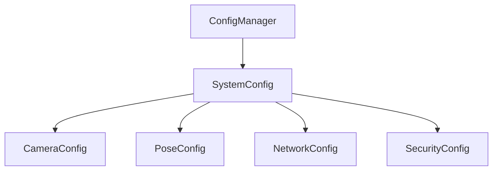

# 配置模块

## 文件结构
- settings.py - 全局配置定义
- config_manager.py - 配置管理器

## 组件依赖关系


## 配置项说明
- [摄像头配置](camera.md) - 相机参数和重试机制
- [姿态检测配置](pose.md) - MediaPipe和处理参数
- [网络配置](network.md) - Socket和传输设置
- [性能配置](performance.md) - 性能优化参数

## 使用示例
```python
from config.settings import CAMERA_CONFIG, POSE_CONFIG
from config.config_manager import ConfigManager

# 使用配置管理器
config_manager = ConfigManager()
system_config = config_manager.get_config()

# 更新配置
config_manager.update_config({
    'camera': {'fps': 60},
    'pose': {'model_complexity': 2}
})
```

## 配置加载流程
1. 尝试加载配置文件
2. 文件不存在时创建默认配置
3. 验证配置格式
4. 合并配置更新

## 错误处理
- 配置文件损坏
- 格式验证失败
- 必需项缺失
``` 