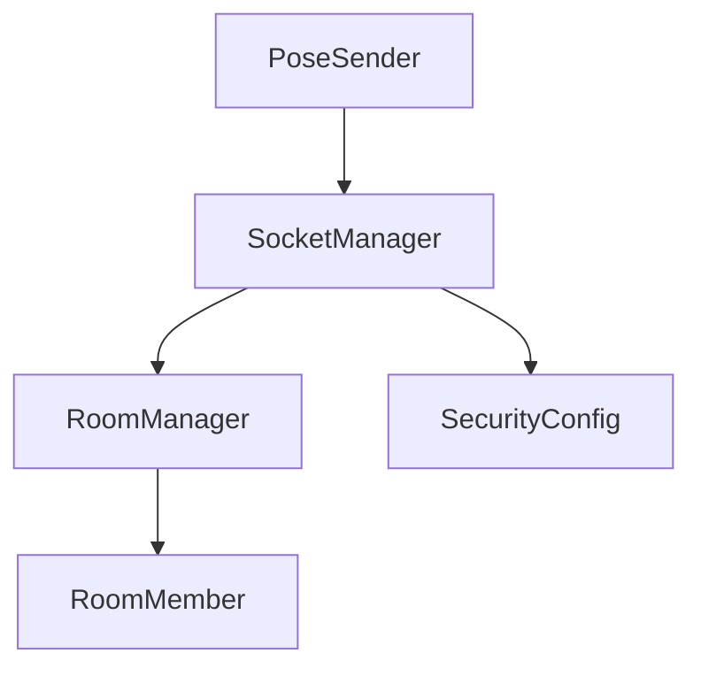

# 连接模块

## 核心组件
- [Socket管理器](socket_manager.md) - WebSocket连接管理
- [房间管理](room_manager.md) - 多房间管理
- [数据发送器](pose_sender.md) - 姿态数据发送

## 组件依赖关系


## 调用流程
1. 初始化连接
```python
socket_manager = SocketManager(socketio)
room_manager = RoomManager(socket_manager)
pose_sender = PoseSender(socket_manager)
```

2. 房间管理
```python
# 创建房间
room_manager.create_room(room_id)

# 加入房间
room_manager.join_room(room_id, user_id)

# 发送数据
pose_sender.send_pose(pose_data, room_id)
```

## 安全机制
- [认证系统](auth.md)
- [数据加密](encryption.md)
- [错误处理](errors.md)

## 性能优化
- [压缩策略](compression.md)
- [缓冲管理](buffer.md)

## 性能指标
- 连接延迟: < 100ms
- 数据传输延迟: < 50ms
- 重连时间: < 1000ms 