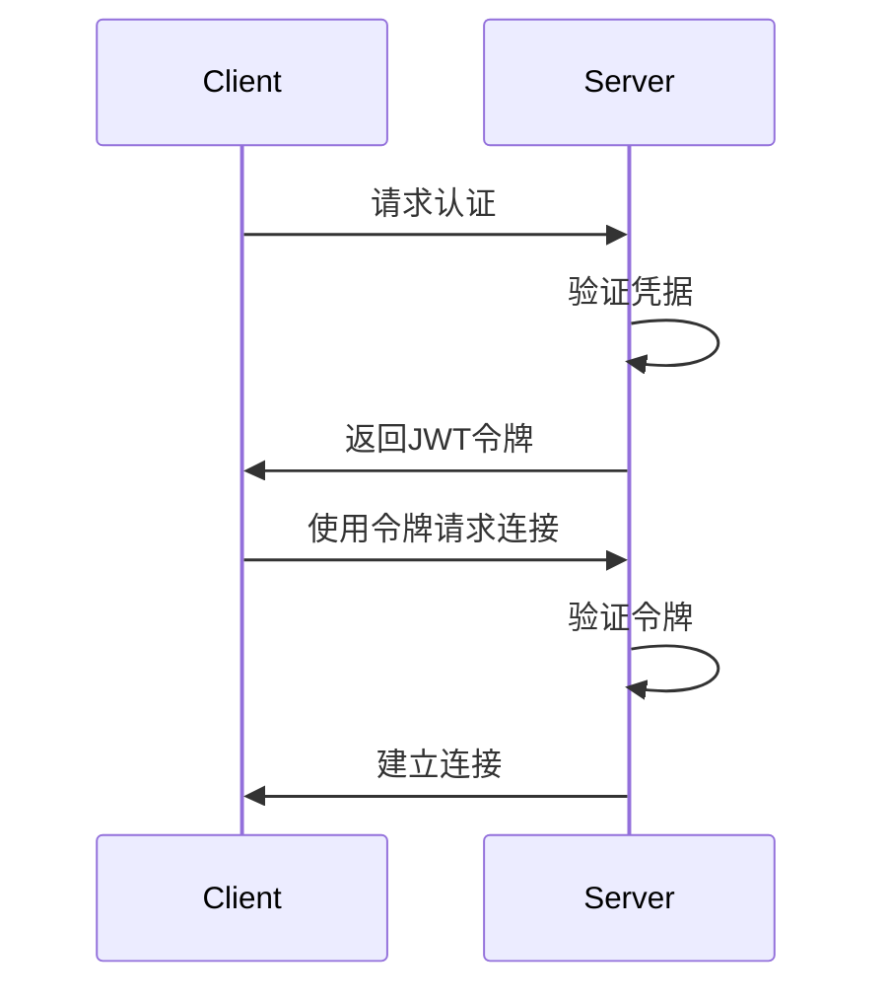

# 认证系统

## 功能说明
负责连接的身份验证和权限管理。

## 认证流程


## 认证配置
```python
SECURITY_CONFIG = {
    'secret_key': 'your-secret-key',
    'token_expiry': 3600,        # Token过期时间(秒)
    'encryption_enabled': True,   # 是否启用加密
    'compression_level': 6        # 压缩级别(0-9)
}
```

## API说明

### authenticate()
```python
def authenticate(self, credentials: Dict[str, str]) -> str:
    """用户认证
    
    Args:
        credentials: 包含用户名和密码的字典
        
    Returns:
        str: JWT令牌
        
    Raises:
        AuthError: 认证失败
    """
```

### verify_token()
```python
def verify_token(self, token: str) -> bool:
    """验证令牌
    
    Args:
        token: JWT令牌
        
    Returns:
        bool: 验证是否成功
    """
```

## 安全措施
1. Token安全
   - 使用JWT签名
   - 设置过期时间
   - 定期轮换密钥

2. 数据安全
   - 传输加密
   - 密码哈希
   - 防重放攻击 