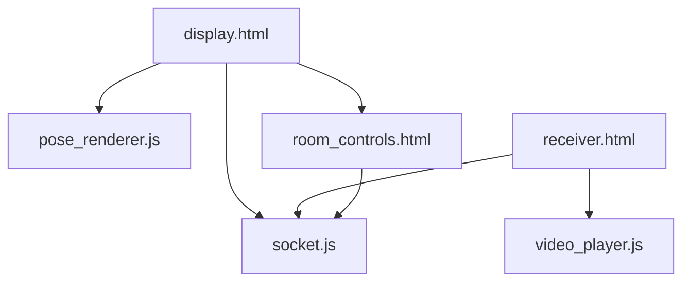

# 前端模块

## 页面结构
```
frontend/
├── pages/          # 页面文件
│   ├── display.html    # 发送端页面
│   └── receiver.html   # 接收端页面
├── static/         # 静态资源
│   ├── js/        # JavaScript文件
│   ├── css/       # 样式文件
│   └── img/       # 图片资源
└── components/    # 可复用组件
```

## 核心组件
- [显示页面(display.html)](pages/display.md) - 视频采集和发送
- [接收页面(receiver.html)](pages/receiver.md) - 视频接收和显示
- [房间控制(room_controls.html)](components/room_controls.md) - 房间管理组件

## 依赖关系


## 通信流程
1. 视频采集
   - 摄像头初始化
   - 帧数据获取
   - 姿态检测

2. 数据传输
   - Socket连接
   - 数据压缩
   - 实时发送

3. 视频显示
   - 数据接收
   - 帧解码
   - 画面渲染 