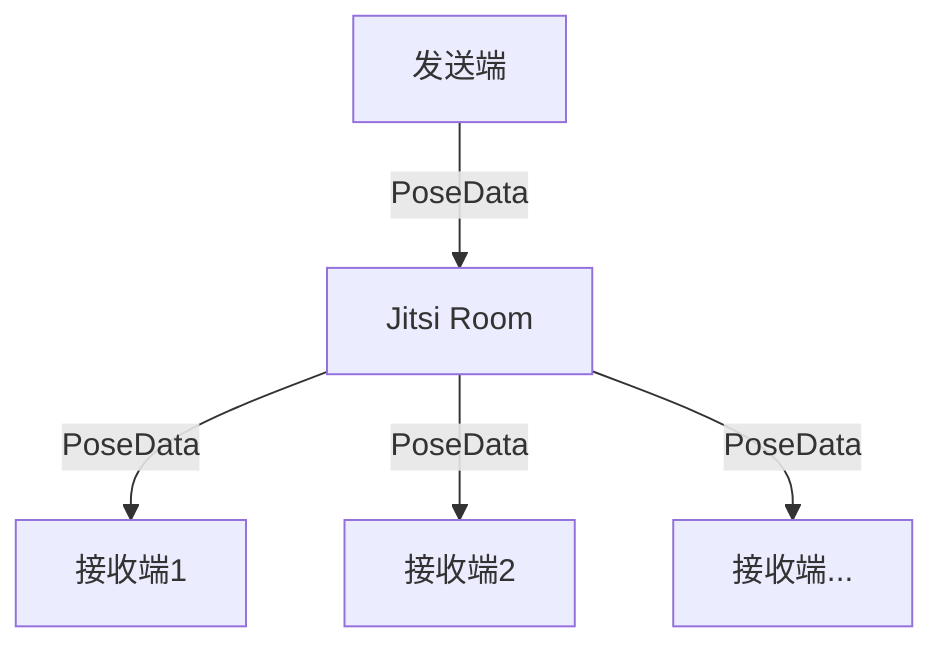

# Jitsi 会议功能集成实施方案

## 1. 会议功能架构

### 1.1 会议数据流


### 1.2 核心组件扩展
```python
# connect/jitsi_room.py
class JitsiRoom:
    def __init__(self, room_id: str, config: Dict):
        self.room_id = room_id
        self.participants = {}  # user_id -> JitsiParticipant
        self.data_channels = {}  # user_id -> DataChannel
        self._active = False
        
    async def join(self, user_id: str):
        """加入会议室"""
        participant = JitsiParticipant(user_id)
        channel = await self._create_data_channel(user_id)
        self.participants[user_id] = participant
        self.data_channels[user_id] = channel
        self._active = True
        
    async def broadcast_pose(self, user_id: str, pose_data: PoseData):
        """广播姿态数据到其他参会者"""
        if not self._active:
            return False
            
        message = {
            'type': 'pose_update',
            'user_id': user_id,
            'pose_data': pose_data.to_bytes(),
            'timestamp': time.time()
        }
        
        tasks = []
        for pid, channel in self.data_channels.items():
            if pid != user_id:  # 不发送给自己
                tasks.append(channel.send(message))
                
        results = await asyncio.gather(*tasks, return_exceptions=True)
        return all(r is not False for r in results)
```

### 1.3 会议管理器
```python
# connect/jitsi_meeting_manager.py
class JitsiMeetingManager:
    def __init__(self, config: Dict):
        self.rooms = {}  # room_id -> JitsiRoom
        self.user_rooms = {}  # user_id -> room_id
        self._config = config
        
    async def create_meeting(self, room_id: str, host_id: str) -> str:
        """创建新会议"""
        if room_id in self.rooms:
            raise RoomExistsError(f"Room {room_id} already exists")
            
        room = JitsiRoom(room_id, self._config)
        await room.join(host_id)
        self.rooms[room_id] = room
        self.user_rooms[host_id] = room_id
        return room_id
        
    async def join_meeting(self, room_id: str, user_id: str):
        """加入现有会议"""
        if room_id not in self.rooms:
            raise RoomNotFoundError(f"Room {room_id} not found")
            
        room = self.rooms[room_id]
        await room.join(user_id)
        self.user_rooms[user_id] = room_id
```

## 2. 前端集成

### 2.1 会议控制组件
```javascript
// frontend/static/js/meeting_controls.js
class MeetingControls {
    constructor(config) {
        this.roomId = null;
        this.userId = null;
        this.participants = new Map();
        this.localPoseStream = null;
        
        // UI elements
        this.initializeUI();
    }
    
    async createMeeting() {
        try {
            const response = await fetch('/api/meeting/create', {
                method: 'POST',
                headers: { 'Content-Type': 'application/json' },
                body: JSON.stringify({ user_id: this.userId })
            });
            
            const { room_id } = await response.json();
            await this.joinMeeting(room_id);
            return room_id;
        } catch (error) {
            console.error('Failed to create meeting:', error);
            throw error;
        }
    }
    
    async joinMeeting(roomId) {
        this.roomId = roomId;
        await this.initializeJitsiConnection();
        this.startLocalPoseStream();
    }
}
```

### 2.2 参会者渲染
```javascript
// frontend/static/js/participant_renderer.js
class ParticipantRenderer {
    constructor(containerId) {
        this.container = document.getElementById(containerId);
        this.renderers = new Map();  // userId -> PoseRenderer
    }
    
    addParticipant(userId) {
        const canvas = document.createElement('canvas');
        this.container.appendChild(canvas);
        const renderer = new PoseRenderer(canvas);
        this.renderers.set(userId, renderer);
    }
    
    updatePose(userId, poseData) {
        const renderer = this.renderers.get(userId);
        if (renderer) {
            renderer.render(poseData);
        }
    }
}
```

## 3. 后端API扩展

### 3.1 会议管理API
```python
# 添加到 run.py
@app.route('/api/meeting/create', methods=['POST'])
async def create_meeting():
    try:
        data = request.get_json()
        user_id = data.get('user_id')
        room_id = await meeting_manager.create_meeting(
            str(uuid.uuid4()), 
            user_id
        )
        return jsonify({
            'success': True,
            'room_id': room_id
        })
    except Exception as e:
        logger.error(f"创建会议失败: {e}")
        return jsonify({
            'success': False,
            'error': str(e)
        }), 500

@app.route('/api/meeting/join', methods=['POST'])
async def join_meeting():
    try:
        data = request.get_json()
        room_id = data.get('room_id')
        user_id = data.get('user_id')
        
        await meeting_manager.join_meeting(room_id, user_id)
        return jsonify({'success': True})
    except Exception as e:
        logger.error(f"加入会议失败: {e}")
        return jsonify({
            'success': False,
            'error': str(e)
        }), 500
```

## 4. 性能优化

### 4.1 多人场景优化
```python
class MultiParticipantOptimizer:
    def __init__(self, config):
        self.max_participants = config.get('max_participants', 16)
        self.quality_levels = {
            'high': {'fps': 30, 'compression': 3},
            'medium': {'fps': 20, 'compression': 6},
            'low': {'fps': 10, 'compression': 9}
        }
        
    def get_optimal_params(self, participant_count: int):
        """根据参会人数返回最优参数"""
        if participant_count <= 4:
            return self.quality_levels['high']
        elif participant_count <= 9:
            return self.quality_levels['medium']
        else:
            return self.quality_levels['low']
```

## 5. 部署更新

### 5.1 部署配置
```python
DEPLOYMENT_CONFIG = {
    'jitsi': {
        'server': 'meet.example.com',
        'port': 443,
        'conference': {
            'max_participants': 16,
            'max_bandwidth': 1500000,  # 1.5 Mbps
            'initial_quality': 'high'
        }
    },
    'monitoring': {
        'metrics_interval': 5,  # 秒
        'alert_webhook': 'https://alert.example.com/webhook'
    }
}
```

### 5.2 部署检查清单补充
- [ ] 会议室创建测试
- [ ] 多人接入测试
- [ ] 带宽压力测试
- [ ] 参会者限制验证
- [ ] 会议录制功能测试
- [ ] 故障恢复演练
- [ ] 监控告警验证 