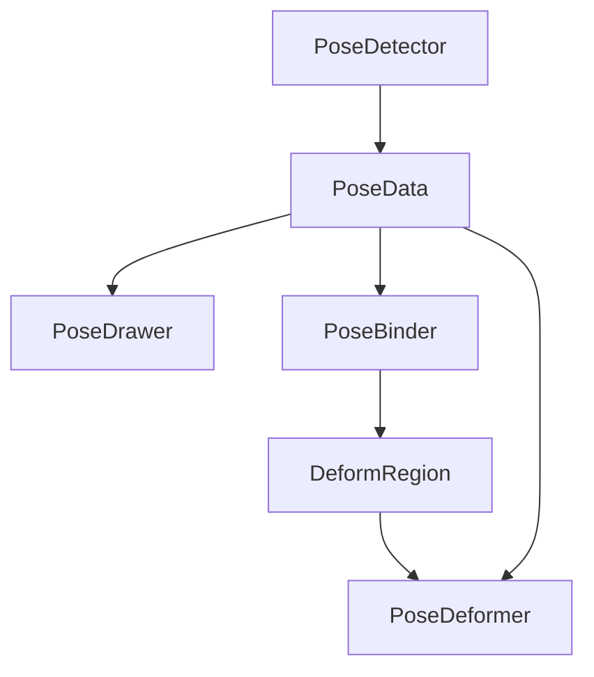

# 姿态处理模块

## 核心组件
- [检测器(Detector)](detector.md) - 负责姿态关键点检测
- [绘制器(Drawer)](drawer.md) - 负责可视化渲染
- [绑定器(Binder)](binder.md) - 负责初始帧区域绑定
- [变形器(Deformer)](deformer.md) - 负责图像变形处理

## 组件依赖关系


## 调用流程
1. 初始化阶段
```python
detector = PoseDetector()
drawer = PoseDrawer()
binder = PoseBinder()
deformer = PoseDeformer()
```

2. 初始帧处理
```python
# 检测姿态
pose_data = detector.detect(initial_frame)

# 创建区域绑定
regions = binder.create_binding(initial_frame, pose_data)

# 可视化结果
visualized = drawer.draw_frame(initial_frame, pose_data)
```

3. 实时处理
```python
while True:
    # 检测新帧姿态
    pose_data = detector.detect(frame)
    
    # 应用变形
    deformed = deformer.deform_frame(initial_frame, regions, pose_data)
    
    # 可视化结果
    visualized = drawer.draw_frame(deformed, pose_data)
```

## 配置说明
所有配置项统一在 config/settings.py 的 POSE_CONFIG 中定义

## 性能指标
- 检测延迟: < 33ms
- 变形延迟: < 10ms
- 绘制延迟: < 5ms
- 总延迟: < 50ms (支持实时处理) 