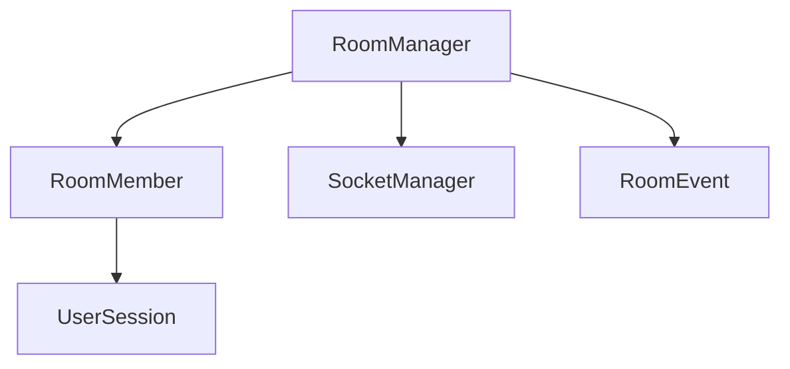

# 房间管理模块

## 核心组件
- [房间管理器(RoomManager)](room_manager.md) - 房间生命周期管理
- [房间成员(RoomMember)](room_member.md) - 成员状态管理
- [房间事件(RoomEvent)](room_event.md) - 事件处理系统

## 组件依赖关系


## 调用流程
1. 房间创建
```python
room_manager = RoomManager(socket_manager)
room_id = "room_123"
success = room_manager.create_room(room_id)
```

2. 成员管理
```python
# 加入房间
user_id = "user_456"
success = room_manager.join_room(room_id, user_id)

# 离开房间
room_manager.leave_room(room_id, user_id)
```

3. 消息广播
```python
# 发送房间消息
room_manager.broadcast("pose_update", pose_data, room_id)
```

## 房间配置
```python
ROOM_CONFIG = {
    'max_clients': 10,        # 最大成员数
    'timeout': 30,           # 超时时间(秒)
    'cleanup_interval': 60   # 清理间隔(秒)
}
```

## 性能指标
- 最大房间数: 100
- 单房间最大成员: 10
- 房间创建延迟: < 10ms
- 成员加入延迟: < 20ms 