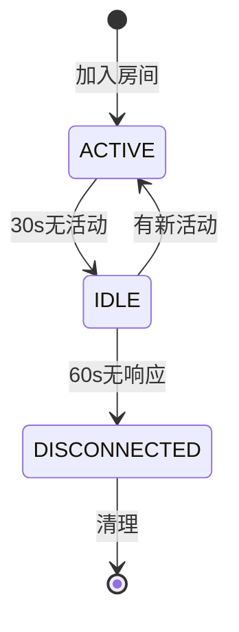

# 房间成员(RoomMember)

## 功能说明
管理房间内单个成员的状态和权限。

## 数据结构
```python
@dataclass
class RoomMember:
    id: str                 # 成员ID
    join_time: float        # 加入时间
    last_active: float      # 最后活跃时间
    role: str              # 角色(host/member)
    status: MemberStatus   # 成员状态
```

## 成员状态
```python
class MemberStatus(Enum):
    ACTIVE = 'active'       # 活跃
    IDLE = 'idle'          # 空闲
    DISCONNECTED = 'disconnected'  # 断开连接
```

## 成员权限
1. 主持人(host)
   - 管理其他成员
   - 控制房间设置
   - 结束会议

2. 普通成员(member)
   - 发送姿态数据
   - 接收其他成员数据
   - 离开房间

## 状态转换


## 活跃度检查
- 心跳间隔: 25s
- 空闲阈值: 30s
- 断开阈值: 60s 